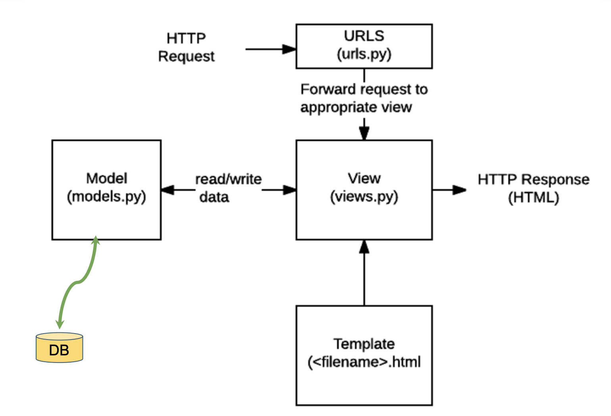
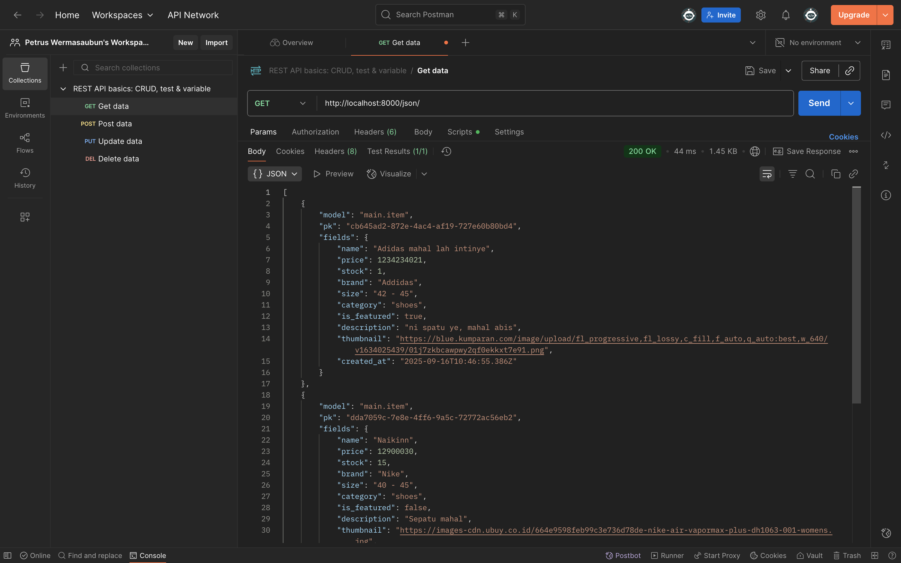
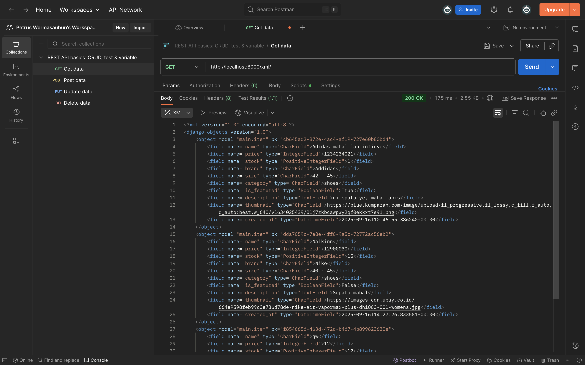
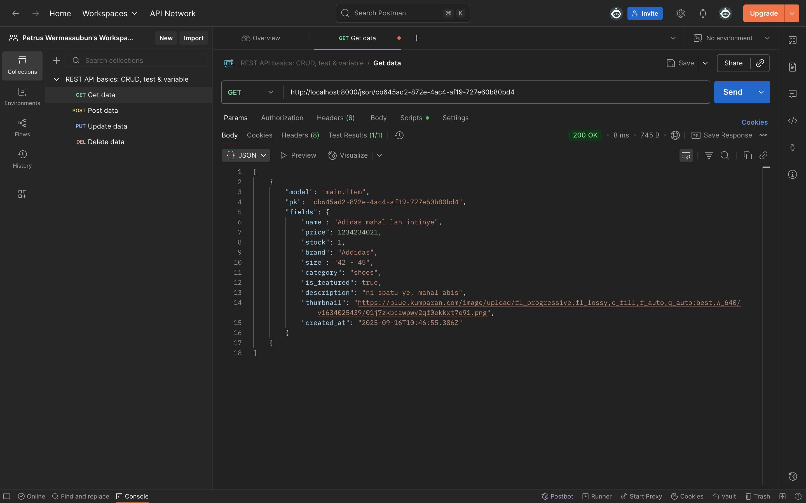
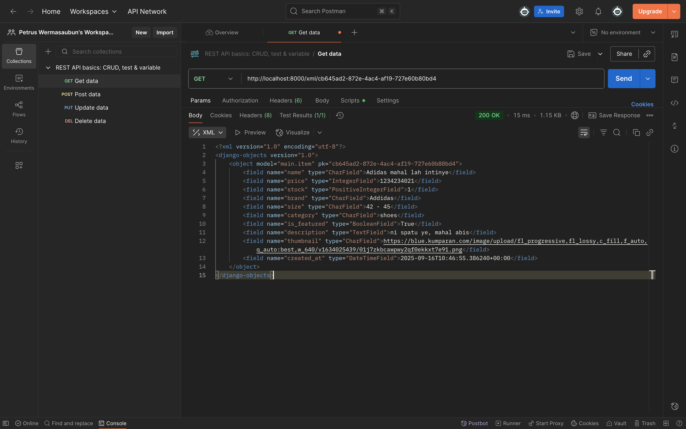
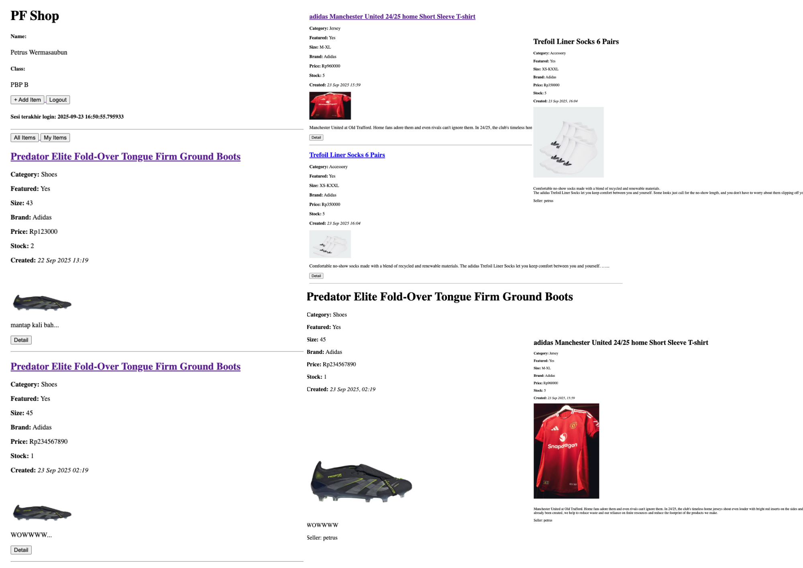
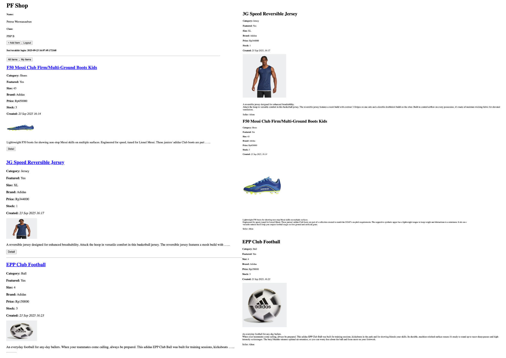

Checklist untuk tugas ini adalah sebagai berikut.

1. Membuat sebuah proyek Django baru.
Sebelum membuat proyek Django baru, sesuai yang ada di tutorial diberikan, terdapat beberapa langkah yang harus saya lakukan

a) Membuat akun GitHub.
=> Namun, apa itu Git dan GitHub?
=> Git: Sistem Kontrol Version untuk Codebase
yang membantu melacak perubahan pada kode sumber proyek
=> GitHub: Platform Kolaborasi Menggunakan Git
platform berbasis web yang memungkinkanmu untuk menyimpan, mengelola, dan berkolaborasi pada proyek-proyek menggunakan Git.
=> Mengapa Penting?
Git dan GitHub memainkan peran penting dalam pengembangan perangkat lunak modern dan kolaborasi tim. Keduanya memungkinkan tim untuk melacak perubahan kode, menyimpan versi, dan bekerja bersama dalam proyek secara efisien.
Dalam langkah ini, saya tidak melakukannya lagi, karena sudah pernah membuat akun GitHub saat di semester 2, yaitu pada mata kuliah DDP 2.

b) Instalasi IDE
=> IDE adalah sebuah software yang menyatukan berbagai alat bantu pemrograman dalam satu tempat, supaya programmer bisa menulis, menjalankan, dan mengelola kode dengan lebih mudah. 
Dalam langkah kedua ini juga saya sudah tidak melakukannya lagi, karena saya sudah menginstal IDE (VS Code) dari saya berada di semester 1, untuk mata kuliah DDP 1.

c) Konfigurasi Git
=> Setelah Git terpasang, saya perlu mendaftarkan identitas diri agar setiap commit (penyimpanan perubahan kode) punya nama dan email yang jelas, hal tersebut dinamakan konfigurasi Git.’
Caranya, dengan menjalankan kode di bawah ke terminal.
<!-- git config --global user.name "<NAME>"
git config --global user.email "<EMAIL>" -->
 flag --global akan mengubah konfigurasi global untuk seluruh sistem (saya sedang bilang ke Git: "kalau aku pakai Git di komputer ini, anggap saja namaku dan emailku selalu ini.”)
Langkah ketiga ini saya juga tidak perlu melakukannya,, karena saya sudah pernah melakukan hal tersebut sebelumnya.

d) Konfigurasi Autentikasi
=> Konfigurasi autentikasi adalah cara saya mengatur identitas agar Git percaya saya punya akses ke repository remote. Tanpa konfigurasi autentikasi, Git akan menolak akses (Authentication failed). Ya intinya untuk nantinya menghubungkan akun Git saya dengan akun GitHub
Caranya ialah sbb (u/ mac), karena saya mac user:
<!-- git credential-manager configure
git config --global credential.credentialStore keychain -->

e) Verifikasi Konfigurasi
=> Untuk memastikan konfigurasi telah diatur dengan benar pada repositori lokal, saya bisa jalankan perintah berikut
<!-- git config --list -->

f) Instalasi Django dan Inisiasi Proyek Django
=> Django adalah kerangka kerja (framework) yang populer untuk pengembangan aplikasi web dengan bahasa pemrograman Python. 
Ada beberapa langkah: 

     1) Membuat Direktori dan Mengaktifkan Virtual Environment
- Saya membuat direktori baru dengan nama Football Shop.
- Buka terminal dari direktori tersebut
- Trus, saya buat virtual environment dengan jalankan perintah berikut
<!-- python3 -m venv env -->
(Virtual environment ini berguna untuk mengisolasi package serta dependencies dari aplikasi agar tidak bertabrakan dengan versi lain yang ada pada komputer saya)
- Selanjutnya, saya aktivin virtual environment dengan perintah berikut.
<!-- source env/bin/activate -->
Tanda udah aktif itu dengan (env) di baris input terminal.

     2) Menyiapkan Dependencies dan Membuat Proyek Django
=> Dependencies adalah komponen atau modul yang diperlukan oleh suatu perangkat lunak untuk berfungsi, termasuk library, framework, atau package. Hal tersebut memungkinkan pengembang memanfaatkan kode yang telah ada, mempercepat pengembangan, tetapi juga memerlukan manajemen yang hati-hati untuk memastikan kompatibilitas versi yang tepat. Penggunaan virtual environment membantu mengisolasi dependencies antara proyek-proyek yang berbeda.
- Di dalam direktori yang Football Shop, saya buat berkas requirements.txt trus tambahkan beberapa dependencies (file teks yang berisi daftar semua library Python yang dibutuhkan oleh sebuah proyek.)
<!-- django
gunicorn
whitenoise
psycopg2-binary
requests
urllib3
Python-dotenv -->
-  Selanjutnya, saya instal dependencies yang ada di terminal yang sebelumnya (yg virtual environment nya udh aktif) dengan perintah berikut.
<!-- pip install -r requirements.txt -->
- Setelah itu, saya buat proyek Django namanya  PF_Shop dengan perintah berikut.
<!-- django-admin startproject PF_Shop . -->

     3) Konfigurasi Environment Variables dan Proyek
- Selanjutnya, saya buat file .env di direktori root proyek (dimana file manage.py berada), isi dengan dibawah:
<!-- PRODUCTION=False  -->
artinya aplikasi masih di mode pengembangan, belum di-deploy ke server beneran.


** Environment variables adalah variabel yang disimpan di luar kode program dan digunakan untuk menyimpan informasi konfigurasi seperti kredensial database, API keys, atau pengaturan environment. Ini memungkinkan kode yang sama berjalan di environment berbeda tanpa perlu mengubah kode.


<!-- - Selanjutnya, saya buat file .env.prod di direktori yang sama untuk konfigurasi production trus isi semua yang ada dibawah (tapi datanya sesuaiin sama yang saya dapet di email)
DB_NAME=<nama database>
DB_HOST=<host database>
DB_PORT=<port database>
DB_USER=<username database>
DB_PASSWORD=<password database>
SCHEMA=tugas_individu
PRODUCTION=True -->


** Perbedaan .env dengan .env.prod
=> .env: Digunakan untuk development lokal. Karena PRODUCTION=False, aplikasi akan menggunakan database SQLite yang lebih simple untuk testing dan development
=> .env.prod: Digunakan untuk production deployment. Karena PRODUCTION=True, aplikasi akan menggunakan database PostgreSQL dengan kredensial yang disediakan ITF Fasilkom UI
- Selanjutnya saya modifikasi file settings.py untuk menggunakan environment variables, dan, tambahin kode dibawah ini, dibagian atas setelah import path
<!-- import os
from dotenv import load_dotenv
# Load environment variables from .env file
load_dotenv() -->
- Setelah itu, saya tambahkan kedua string berikut pada ALLOWED_HOSTS di settings.py untuk keperluan development:
<!-- …
ALLOWED_HOSTS = ["localhost", "127.0.0.1"]
... -->
** Dalam konteks deployment, ALLOWED_HOSTS berfungsi sebagai daftar host yang diizinkan untuk mengakses aplikasi web. Dengan menetapkan nilai di atas, saya mengizinkan akses dari host lokal, artinya hanya bisa diakses dari jaringan saya saja. Namun, apabila saya men-deploy aplikasi ke suatu server, pastikan bahwa saya menambahkan host dari server tersebut pada ALLOWED_HOSTS.
- Setelah itu, saya tambahin konfigurasi PRODUCTION di atas code DEBUG di settings.py.
<!-- PRODUCTION = os.getenv('PRODUCTION', 'False').lower() == 'true' -->
** Supaya gak perlu edit file settings.py tiap kali pindah dari laptop (development) ke server (production). Cukup atur environment variable PRODUCTION=True → otomatis Django ngerti dia harus jalan di mode production.
- Setelah itu, saya ubah konfigurasi database di settings.py. Cari bagian DATABASES dan ganti dengan:
<!-- # Database configuration
if PRODUCTION:
    # Production: gunakan PostgreSQL dengan kredensial dari environment variables
    DATABASES = {
        'default': {
            'ENGINE': 'django.db.backends.postgresql',
            'NAME': os.getenv('DB_NAME'),
            'USER': os.getenv('DB_USER'),
            'PASSWORD': os.getenv('DB_PASSWORD'),
            'HOST': os.getenv('DB_HOST'),
            'PORT': os.getenv('DB_PORT'),
            'OPTIONS': {
                'options': f"-c search_path={os.getenv('SCHEMA', 'public')}"
            }
        }
    }
else:
    # Development: gunakan SQLite
    DATABASES = {
        'default': {
            'ENGINE': 'django.db.backends.sqlite3',
            'NAME': BASE_DIR / 'db.sqlite3',
        }
    } -->
*** Gunanya adalah konfigurasi database dinamis, artinya jenis database yang dipakai akan berbeda tergantung apakah aplikasi jalan di development atau production.
Fleksibel → Bisa beda database antara development dan production.
Aman → Kredensial database tidak disimpan di kode, tapi di environment variable.
Praktis → Developer cukup pakai SQLite, deployment otomatis pakai PostgreSQL.

     4) Jalankan Server
=> Selanjutnya, saya pastikan bahwa berkas manage.py ada di direktori yang aktif di terminal saya saat ini, trus saya jalankan migrasi database dengan perintah:
<!-- python3 manage.py migrate -->
Setelah itu saya jalankan server Django dengan perintah
<!-- python3 manage.py runserver -->
Lalu, untuk cek apakah aplikasi Django saya berhasil atau tidak, saya buka http://localhost:8000 di chrome saya untuk liat animasi roket sebagai tanda berhasil atau tidaknya.

f) Unggah Proyek ke Repositori GitHub
=> Saya buat repositori GitHub baru dengan nama yang sama yaitu PF_Shop, trus inisiasi direktori lokal PF_Shop sebagai repositori Git.
Trus, saya jalankan perintah git init di terminal, gunanya untuk membuat folder .git yang dipake untuk melacak perubahan file secara lokal
=> Setelah itu, saya tambahin berkas .gitignore, merupakan konfigurasi yang digunakan di repositori Git untuk menentukan berkas-berkas dan direktori-direktori yang harus diabaikan oleh Git. Berkas ini perlu dibuat karena kadang ada berkas-berkas yang ga perlu dilacak Git, seperti berkas-berkas yang dihasilkan oleh proses kompilasi, berkas sementara, atau berkas konfigurasi pribadi
Isinya seperti dibawah ini:
<!-- # Django
*.log
*.pot
*.pyc
**pycache**
db.sqlite3
media
# Backup files
*.bak
# If you are using PyCharm
# User-specific stuff
.idea/**/workspace.xml
.idea/**/tasks.xml
.idea/**/usage.statistics.xml
.idea/**/dictionaries
.idea/**/shelf
# AWS User-specific
.idea/**/aws.xml
# Generated files
.idea/**/contentModel.xml
.DS_Store
# Sensitive or high-churn files
.idea/**/dataSources/
.idea/**/dataSources.ids
.idea/**/dataSources.local.xml
.idea/**/sqlDataSources.xml
.idea/**/dynamic.xml
.idea/**/uiDesigner.xml
.idea/**/dbnavigator.xml
# Gradle
.idea/**/gradle.xml
.idea/**/libraries
# File-based project format
*.iws
# IntelliJ
out/
# JIRA plugin
atlassian-ide-plugin.xml
# Python
*.py[cod]
*$py.class
# Distribution / packaging
.Python build/
develop-eggs/
dist/
downloads/
eggs/
.eggs/
lib/
lib64/
parts/
sdist/
var/
wheels/
*.egg-info/
.installed.cfg
*.egg
*.manifest
*.spec
# Installer logs
pip-log.txt
pip-delete-this-directory.txt
# Unit test / coverage reports
htmlcov/
.tox/
.coverage
.coverage.*
.cache
.pytest_cache/
nosetests.xml
coverage.xml
*.cover
.hypothesis/
# Jupyter Notebook
.ipynb_checkpoints
# pyenv
.python-version
# celery
celerybeat-schedule.*
# SageMath parsed files
*.sage.py
# Environments
.env*
!.env.example*
.venv
env/
venv/
ENV/
env.bak/
venv.bak/
# mkdocs documentation
/site
# mypy
.mypy_cache/
# Sublime Text
*.tmlanguage.cache
*.tmPreferences.cache
*.stTheme.cache
*.sublime-workspace
*.sublime-project
# sftp configuration file
sftp-config.json
# Package control specific files Package
Control.last-run
Control.ca-list
Control.ca-bundle
Control.system-ca-bundle
GitHub.sublime-settings
# Visual Studio Code
.vscode/*
!.vscode/settings.json
!.vscode/tasks.json
!.vscode/launch.json
!.vscode/extensions.json
.history -->

Selanjutnya, saya hubungkan repositori lokal dengan repositori GitHub yang telah dibuat sebelumnya, dengan perintah
<!-- git remote add origin https://github.com/pit135/PF_Shop.git -->
Perintah ini nambahin remote bernama origin yang menunjuk ke repositori GitHub saya, dengan nambahin remote ini, Git tau kemana harus mengirim kode kamu saat melakukan push. Terus, buat branch utama dengan nama master, trus jalanin perintah
<!-- git branch -M master -->
Trus pas udah, aku add, commit, dan push dari direktori repositori lokal ke git dengan cara pada umumnya/biasanya

g) Pembuatan Akun dan Deployment melalui PWS (Pacil Web Service)
=> Saya buka https://pbp.cs.ui.ac.id, trus login dengan SSO UI. Trus saya buat proyek baru dengan nama footballshoppp (gaboleh ada yg kapital). Trus kalo udah, pas akan keluar/muncul Project Credentials dan Project Command, nah yg project credential saya simpen di gdocs supaya ga ilang, karna ga akan ditampilin lagi tapi sangat amat penting.
Selanjutnya, saya ke bagian environs, trus isi raw editor dengan database yang dikasi di email tadi, atau yang ada di .env.prod.
Trus, di settings.py di proyek Django saya tambahin URL deployment PWS di bagian ALLOWED_HOSTS, URL deployment PWS formatnya <username-sso>-<nama proyek>.pbp.cs.ui.ac.id, jadi punya saya namanya petrus-wermasaubun-footballshoppp.pbp.cs.ui.ac.id.
<!-- ALLOWED_HOSTS = ["localhost", "127.0.0.1", "<URL deployment PWS>"] -->

ini penting dilakukan supaya proyek Django bisa diakses melalui URL deployment PWS, trus saya lakukan git add, commit, dan push perubahan ini ke repositori GitHub seperti biasa, trus akan diminta username dan pw, nah saya masukin yang dari project credentials diawal. Trus kalo udah bisa pencet view peoject, brati projectnya dh kelar aman


<!-- ........................................................................................................................................................... -->


2. Membuat aplikasi dengan nama main pada proyek tersebut.
- Sebelum membuat aplikasi main, saya aktifkan dulu virtual environment yang udh dibuat sebelumnya dengan tujuan yang sudah saya sampaikan juga diata
- Setelah itu, saya jalankan kode dibawah agar muncul direktori baru dengan nama main, yang berisi struktur awal untuk aplikasi Django
python manage.py startapp main
- Selanjutnya, saya daftarin aplikasi main ke dalam proyek, yaitu dengan membuka berkas settings.py di dalam direktori proyek PF-Shop, tambahin  'main' ke dalam daftar aplikasi yang ada sebagai elemen paling terakhir
INSTALLED_APPS isinya daftar aplikasi yg dapat saya akses

<!-- INSTALLED_APPS = [
    ...,
    'main'
] -->

- Selanjutnya saya mengimplementasi template dasar, dimana membuat template yang berada di direktori templates yang berada di main. Template ini gunanya untuk menampilkan data program football shop saya.
- Langkah pertama adalah, membuat dan mengisi Berkas main.html. Apa itu HTML? HTML atau (Hypertext Markup Language) adalah bahasa penanda yang digunakan di halaman web untuk menafsirkan dan menulis teks, gambar dan bahan lainnya secara visual maupun suara. Selanjutnya, saya membuat direktori baru bernama templates di dalam direktori aplikasi main, trus buat berkas baru bernama main.html, isi dengan tamplate dibawah ( yg udh saya edit dengan data diri saya)

<!-- <h1> PF_Shop </h1>

<h4>Name: </h4>
<p>Pak Bepe</p> 
<h4>Class: </h4>
<p>PBP A</p>  -->

Seperti pengertiannya, yang saya lakukan diatas adalah hanya memeriksa tampilan dasar HTML dan belum terhubung dengan Django, jd saya buka dlu filenya di web, kalo udh sesuai penampakannya seperti yang saya mau, saya lanjutkan.


<!-- ........................................................................................................................................................... -->


3. Melakukan routing pada proyek agar dapat menjalankan aplikasi main
=> Setelah sudah memiliki aplikasi main di dalam proyek Django, supaya aplikasinya bisa dijalankan lewat browser saya perlu routing dulu, routing ini menghubungkan URL yang diakses client dengan view (fungsi/kelas) di aplikasi
langkah-langkahnya:
a) saya pastikan app main sudah dibuat & terdaftar
python manage.py startapp main
b) Setelah itu, di settings.py, saya tambahkan main ke INSTALLED_APPS:

<!-- INSTALLED_APPS = [
    ...
    'main', -->
buat file urls.py di dalam app main
dengan isi:
<!-- from django.urls import path
from . import views

urlpatterns = [
    path('', views.index, name='index'),  # URL root diarahkan ke fungsi index
] -->
c) di main/urls.py ke PF_Shop/urls.py
saya tambahkan di file PF_shop/urls.py:
<!-- from django.contrib import admin
from django.urls import path, include

urlpatterns = [
    path('admin/', admin.site.urls),
    path('', include('main.urls')),   # routing ke app main
] -->
d) Jalankan server
Setelah itu, harusnya udh aman dibuka webnya


<!-- ........................................................................................................................................................... -->


4. Membuat model pada aplikasi main dengan nama Product dan memiliki atribut wajib 
Disini, saya mengubah berkas models.py yang ada di dalam direktori aplikasi main untuk mendefinisikan model baru

<!-- from django.db import models
import uuid

class Item(models.Model):
   CATEGORY_CHOICES = [
       ('jersey', 'Jersey'),
       ('shoes', 'Shoes'),
       ('ball', 'Ball'),
       ('accessory', 'Accessory'),
   ]
  
   id = models.UUIDField(primary_key=True, default=uuid.uuid4, editable=False)
   name = models.CharField(max_length=255)                # nama item
   price = models.IntegerField()                          # Harga item
   stock = models.PositiveIntegerField(default=0)         # Stok item
   brand = models.CharField(max_length=100)               # Brand (misal: Adidas, Nike)
   size = models.CharField(max_length=50, blank=True)     # Ukuran (misal: US8.5, FR42)
   category = models.CharField(max_length=50, choices=CATEGORY_CHOICES)
   is_featured = models.BooleanField(default=False)       # Status unggulan
   description = models.TextField()                       # Deskripsi
   thumbnail = models.URLField(blank=True, null=True)     # Link gambar
   created_at = models.DateTimeField(auto_now_add=True)   # Otomatis isi waktu dibuat


   def __str__(self):
       return f"{self.name} - Rp{self.price:,}" -->

Penjelasan tiap code:
=> from django.db import models
mengimpor modul models dari framework Django, dan ini adalah modul inti yang saya butuhkan untuk mendefinisikan model, yaitu representasi tabel database saya

=> import uuid
Mengimpor modul uuid dari Python, modul ini untuk menghasilkan UUID (Universally Unique Identifier), untuk membuat ID utama yang unik secara universal

=> class Item(models.Model)
deklarasi kelas Python yang mendefinisikan model item. Kelas ini mewarisi dari models.Model, yang memberikannya semua fungsionalitas yang diperlukan untuk berinteraksi dengan database (misalnya, membuat, membaca, memperbarui, dan menghapus entri tabel)

=> CATEGORY_CHOICE
adalah sebuah daftar tuple yang digunakan untuk pilihan tetap untuk field category. Dengan cara ini, Anda memastikan bahwa nilai untuk kategori selalu konsisten dan terbatas pada pilihan yang ditentukan
'jersey': nilai aktual yang disimpan dalam database
'Jersey': teks yang akan ditampilkan di antarmuka administrasi Django

=>  id = models.UUIDField(primary_key=True, default=uuid.uuid4, editable=False)
- id: berfungsi sebagai kunci utama (primary key) untuk setiap entri
- models.UUIDField: untuk menyimpan UUID
- primary_key=True: untuk kunci utama tabel
- default=uuid.uuid4: atur nilai default untuk field ini, setiap kali objek baru dibuat, UUID acak akan dihasilkan secara otomatis
- editable=False: mencegah nilai ini diubah melalui antarmuka administrasi

=> name = models.CharField(max_length=255)  
name: field ini menyimpan nama item
models.CharField: untuk string dengan panjang tetap
max_length=255: tetapkan panjang maksimum string, sebuah batasan yang umum untuk kolom teks pendek

=> price = models.IntegerField()       
price: field ini menyimpan harga item
models.IntegerField: untuk menyimpan bilangan bulat

=> stock = models.PositiveIntegerField(default=0)   
stock: field ini menyimpan jumlah stok item yang tersedia
models.PositiveIntegerField: Tipe field yang hanya menerima bilangan bulat non-negatif (0 atau lebih)
default=0: nilai default adalah 0 jika tidak ada nilai yang diberikan saat membuat objek.

=> brand = models.CharField(max_length=100)      
(misal: Adidas, Nike)
brand: field untuk menyimpan nama merek

=> size = models.CharField(max_length=50, blank=True)   
size: field untuk menyimpan ukuran item
blank=True: memungkinkan field ini kosong (misalnya, jika item tidak memiliki ukuran, seperti bola)

=> category = models.CharField(max_length=50 choices=CATEGORY_CHOICES)
category: field ini menyimpan kategori item
choices=CATEGORY_CHOICES: gunakan daftar tuple yang didefinisikan sebelumnya untuk membatasi pilihan yang valid

=> is_featured = models.BooleanField(default=False)   
is_featured: field boolean untuk menunjukkan apakah item ini ditampilkan di halaman utama atau promosi
models.BooleanField: tipe field yang menyimpan nilai True atau False
default=False: Nilai default adalah False

=> description = models.TextField() 
description: field untuk menyimpan deskripsi item
models.TextField: untuk string teks yang panjang, tanpa batasan panjang maksimum seperti CharField

=> thumbnail = models.URLField(blank=True, null=True) 
thumbnail: field untuk menyimpan URL gambar kecil (thumbnail).
models.URLField: untuk menyimpan URL yang valid
blank=True: memungkinkan field ini kosong di formulir
null=True: memungkinkan nilai database jadi NULL (tidak ada nilai)Blank hanya berlaku untuk formulir, sedangkan null berlaku untuk database

=> created_at = models.DateTimeField(auto_now_add=True)
created_at: field untuk mencatat waktu pembuatan objek
models.DateTimeField: menyimpan tanggal dan waktu
auto_now_add=True: otomatis mengisi waktu saat ini (ketika objek pertama kali dibuat) dan tidak dapat diubah setelah itu

<!-- =>  def __str__(self):
        return f"{self.name} - Rp{self.price:,}"
def __str__(self) -->
metode khusus Python yang mendefinisikan representasi string dari objek
Fungsi: mencetak objek Item (misalnya di konsol Django Shell atau antarmuka admin), ia akan menampilkan format yang mudah dibaca
<!-- f"{self.name} - Rp{self.price:,}": Ini adalah f-string yang memformat output -->
self.name: akses nama item
self.price: akses harga item dan menambahkan pemisah koma untuk ribuan (contoh: 1,000,000). Ini membuat harga lebih mudah dibaca


<!-- ........................................................................................................................................................... -->


5. Membuat sebuah fungsi pada views.py untuk dikembalikan ke dalam sebuah template HTML yang menampilkan nama aplikasi serta nama dan kelas kamu

Disini, saya mengintegrasikan komponen MVT, dengan impelemntasi code dibawah

<!-- from django.shortcuts import render

def show_main(request):
    context = {
        'name': 'Petrus Wermasaubun',
        'class': "PBP B",
  
    }

    return render(request, "main.html", context) -->

Penjelasan Kode:
<!-- from django.shortcuts import render -->
=> from django.shortcuts import render berguna untuk mengimpor fungsi render dari modul django
=> Fungsi render akan digunakan untuk render tampilan HTML dengan menggunakan data yang diberikan 
=> fungsi show_main di bawah impor:
kode di atas mendeklarasikan fungsi show_main, yang menerima parameter request, dimana fungsi ini akan mengatur permintaan HTTP dan mengembalikan tampilan yang sesuai
context adalah dictionary yang berisi data untuk dikirimkan ke tampilan, saat ini ada 2 data yang disertakan, yaitu:
name: data nama saya
class: data kelas saya
<!-- return render(request, "main.html", context)  -->
berguna untuk me-render tampilan main.html dengan menggunakan fungsi render, dimana fungsi render mengambil 2 argumen
=> request: adalah objek permintaan HTTP yang dikirim oleh pengguna
=> main.html: adalah nama berkas template yang akan digunakan untuk me-render tampilan
=> context: adalah dictionary yang berisi data yang akan diteruskan ke tampilan untuk digunakan dalam penampilan dinamis


<!-- ........................................................................................................................................................... -->


6. Membuat sebuah routing pada urls.py aplikasi main untuk memetakan fungsi yang telah dibuat pada views.py.
=> Setelah membuat template dan mengonfigurasikannya pada view, melakukan routing agar aplikasi main dapat diakses oleh browser client
apa itu Routing di Django? routing adalah proses memetakan suatu URL ke sebuah view function atau class-based view (cara lain untuk membuat view namun menggunakan class guna mengorganisasi kode lebih baik) yang sudah kita definisikan, saat client mengakses URL tertentu, Django akan mencocokkan URL tersebut dengan pola yang ada di file urls.py, jika ada kecocokan, maka Django akan menjalankan view yang terkait dan mengembalikan response kepada client

=> Langkah 1:
saya mengonfigurasi Routing URL aplikasi main, dengan buat berkas urls.py di dalam direktori main
isi urls.py kode:
<!-- from django.urls import path
from main.views import show_main

app_name = 'main'

urlpatterns = [
    path('', show_main, name='show_main'),
] -->
penjelasan kode:
- file urls.py berisi konfigurasi routing untuk aplikasi main
- impor fungsi path dari modul django.urls untuk mendefinisikan pola URL
- impor fungsi show_main dari main.views yang akan dipanggil saat URL cocok dengan pola yang ditentukan
- app_name = 'main' digunakan untuk memberikan namespace unik pada URL dalam aplikasi, sehingga mudah dibedakan saat ada banyak aplikasi dan endpoint dalam proyek Django
- urlpatterns adalah list berisi objek URLPattern yang dihasilkan oleh fungsi path()
- di contoh ini, hanya ada satu route '' (root), yang akan memanggil view show_main
- agumen opsional name='show_main' memudahkan saya melakukan reverse URL menggunakan nama, bukan hardcoded string path

=> Langkah 2: 
mengonfigurasi Routing URL Proyek
Setelah itu saya melengkapi rute URL ke aplikasi main dengan menambahkan urls.py pada level proyek agar proyek dapat melakukan pemetaan ke rute URL pada aplikasi main
Berkas urls.py di dalam direktori proyek
Impor fungsi include dari django.urls
<!-- from django.urls import path, include -->
Selanjutnya, saya tambahkan rute URL berikut untuk mengarahkan ke tampilan main di dalam list urlpatterns
<!-- urlpatterns = [
    ...
    path('', include('main.urls')),
    ...
] -->
penjelasan kode:
- berkas urls.py proyek bertanggung jawab untuk mengatur rute URL level proyek
- fungsi include digunakan untuk mengimpor pola rute URL dari aplikasi lain (dalam hal ini dari aplikasi main) ke dalam berkas urls.py level proyek
- path URL '' akan diarahkan ke rute yang didefinisikan dalam berkas urls.py aplikasi main. Path URL dibiarkan berupa string kosong agar halaman aplikasi main dapat diakses secara langsung

Penjelasan diagram di tutorial:
- Client Request → Request dikirim oleh browser/HTTP client
- urls.py Level Projek → Semua request masuk pertama kali ke urls.py di project
- Jika pola cocok dengan include('main.urls'), request diteruskan ke urls.py aplikasi
- Jika tidak cocok, Django mengembalikan 404 Not Found
- urls.py Level Aplikasi → Pola URL di dalam aplikasi (main/urls.py) diproses
- View → Jika cocok, fungsi/class view dijalankan


<!-- ........................................................................................................................................................... -->


7. Melakukan deployment ke PWS terhadap aplikasi yang sudah dibuat sehingga nantinya dapat diakses oleh teman-temanmu melalui Internet.
=> Pembuatan Akun dan Deployment melalui PWS (Pacil Web Service)
Saya buka https://pbp.cs.ui.ac.id, trus login dengan SSO UI. Trus saya buat proyek baru dengan nama footballshoppp (gaboleh ada yg kapital). Trus kalo udah, pas akan keluar/muncul Project Credentials dan Project Command, nah yg project credential saya simpen di gdocs supaya ga ilang, karna ga akan ditampilin lagi tapi sangat amat penting.
Selanjutnya, saya ke bagian environs, trus isi raw editor dengan database yang dikasi di email tadi, atau yang ada di .env.prod.
Trus, di settings.py di proyek Django saya tambahin URL deployment PWS di bagian ALLOWED_HOSTS, URL deployment PWS formatnya <username-sso>-<nama proyek>.pbp.cs.ui.ac.id, jadi punya saya namanya petrus-wermasaubun-footballshoppp.pbp.cs.ui.ac.id.
<!-- ALLOWED_HOSTS = ["localhost", "127.0.0.1", "<URL deployment PWS>"] -->
ini penting dilakukan supaya proyek Django bisa diakses melalui URL deployment PWS, trus saya lakukan git add, commit, dan push perubahan ini ke repositori GitHub seperti biasa, trus akan diminta username dan pw, nah saya masukin yang dari project credentials diawal. Trus kalo udah bisa pencet view peoject, brati projectnya dh kelar aman
Ya, intinya supaya teman2 saya bisa liat, tinggal saya share url project saya, atoga mereka harusnya bisa liat di readme ini, karena saya cantumin link url project saya dan direktori ini di git juga bersifat public, sapapun bisa liatt...


<!-- ........................................................................................................................................................... -->


8. Buatlah bagan yang berisi request client ke web aplikasi berbasis Django beserta responnya dan jelaskan pada bagan tersebut kaitan antara urls.py, views.py, models.py, dan berkas html.

Penjelasan Bagan:
a) Permintaan HTTP (HTTP Request)
Dimulai saat pengguna mengetik URL atau klik tautan di web, maka akan menghasilkan permintaan HTTP yang dikirim dari browser pengguna ke server web
b) URL Dispatcher (urls.py)
Django memiliki file urls.py yang berfungsi sebagai "peta jalan" untuk seluruh proyek, ketika permintaan HTTP tiba, Django akan melihat path dari permintaan tersebut (misalnya, /tentang/ atau /produk/123/, dll), lalu Django mencoba mencocokkan path ini dengan pola URL yang telah kita definisikan di urls.py, kalau ada pola yang cocok, Django akan meneruskan permintaan ke biew yang sesuai (yang ditentukan dalam pola URL), tapi kalo tidak ada pola yang cocok, Django akan mengembalikan respons HTTP 404 (Not Found)
c) View (views.py)
View adalah pusat dari logika aplikasi Django kita, view menerima objek permintaan HTTP (Request) yang berisi informasi tentang permintaan tersebut (misalnya, data formulir, cookie, header, dll), jika view perlu mengakses atau memanipulasi data, ia akan berinteraksi dengan model (models.py), view akan meminta data dari model (misalnya, "ambil semua produk yang harganya di bawah 100") atau menyimpan data baru ke dalamnya, lalu setelah view mendapatkan data yang dibutuhkan, ia akan memprosesnya (misalnya, menghitung total harga) dan mempersiapkannya untuk ditampilkan
d) Model (models.py)
Model adalah representasi objek dari tabel di database kita, kita bisa menganggapnya sebagai jembatan antara view dan database, view tidak berkomunikasi langsung dengan database menggunakan SQL melainkan view menggunakan metode-metode yang disediakan oleh model untuk membaca atau menulis data. Contohnya, Produk.objects.get(id=123) adalah perintah yang digunakan untuk mengambil data produk dengan ID tertentu, model berkomunikasi langsung dengan database yang sebenarnya, baik itu PostgreSQL, MySQL, atau SQLite, untuk menyimpan dan mengambil data
e) Template (<namafile>.html)
Setelah view selesai memproses data, ia akan mengambil file Template (biasanya berkas HTML), template ini berisi kerangka antarmuka pengguna. View akan menyuntikkan data yang sudah diproses ke dalam template, dengan cara ini, template menjadi dinamis dan dapat menampilkan data yang berbeda setiap kali dimuat
f) Respons HTTP (HTTP Response)
Setelah template diisi dengan data, view akan mengemasnya menjadi sebuah Respons HTTP yang lengkap, respons HTTP ini kemudian dikirim kembali ke server web, yang pada gilirannya mengirimkannya ke browser pengguna.
g) Halaman web ditampilkan
Terakhir, browser pengguna menerima Respons HTTP, memproses kode HTML, dan merender halaman web yang utuh, dinamis, dan interaktif yang dapat dilihat dan digunakan oleh pengguna.

intinya: request masuk ke urls.py yang mengarahkannya ke views.py, lalu view berinteraksi dengan models.py untuk mengelola data, dan kemudian menggunakan template HTML untuk menyajikan hasilnya kepada pengguna


<!-- ........................................................................................................................................................... -->


9. Jelaskan peran settings.py dalam proyek Django!
=> Dalam proyek Django, settings.py adalah file konfigurasi utama yang mengontrol semua aspek dari proyek web saya, simplenya atau bisa dianggap sebagai "otak" dari aplikasi Django saya
Setiap proyek Django pasti memiliki satu file settings.py yang berisi variabel-variabel global yang nentuin bagaimana aplikasi akan bekerja, mulai dari koneksi database sampai lokasi file statis


<!-- ........................................................................................................................................................... -->


10. Bagaimana cara kerja migrasi database di Django?
=> Migrasi database di Django adalah mekanisme untuk mengelola perubahan struktur database (misalnya membuat tabel baru, menambah kolom, menghapus kolom, atau mengubah tipe data) sesuai dengan perubahan yang saya buat di kode Python (dalam models.py).

Cara kerjanya:

=> membuat/mengubah model
dengan mendefinisikan struktur data di models.py.
Contoh:
<!-- from django.db import models
class Product(models.Model):
    name = models.CharField(max_length=100)
    price = models.DecimalField(max_digits=10, decimal_places=2) -->

=> membuat file migrasi (makemigrations)
Django membaca perubahan pada models.py lalu menghasilkan file migrasi (misalnya 0001_initial.py) di folder migrations/
perintah:
<!-- python manage.py makemigrations -->
File migrasi ini berisi instruksi Python yang mewakili perubahan database, misalnya CreateModel, AddField, atau AlterField

=> menerapkan migrasi (migrate)
perintah:
<!-- python manage.py migrate -->
Django membaca file migrasi, lalu menerjemahkannya menjadi SQL statements (perintah SQL) yang dijalankan di database
misal:
<!-- CREATE TABLE product (
    id integer PRIMARY KEY AUTOINCREMENT,
    name varchar(100),
    price decimal(10,2)
); -->

=> catat migrasi di django_migrations
Django menyimpan riwayat migrasi yang sudah dijalankan di tabel khusus bernama django_migrations, supaya Django tau migrasi mana yang sudah diterapkan dan mana yang belum


<!-- ........................................................................................................................................................... -->


11. Menurut Anda, dari semua framework yang ada, mengapa framework Django dijadikan permulaan pembelajaran pengembangan perangkat lunak?
=> Alasan Django sering dijadikan framework permulaan dalam pembelajaran pengembangan perangkat lunak (khususnya web development) adalah karena sifat Django yang lengkap, terstruktur, dan edukatif
Berikut beberapa poin utamanya:

a) Baterai terpasang (Batteries Included)
Django menyediakan banyak fitur bawaan: ORM (Object Relational Mapping), autentikasi user, admin panel, form handling, middleware, templating system, dsb. Pemula tidak perlu menginstal banyak library tambahan untuk membangun aplikasi yang cukup kompleks

b) Struktur yang teratur (MVC/MVT)
Django memaksa kita menggunakan arsitektur MVT (Model–View–Template), sehingga sejak awal mahasiswa/pembelajar terbiasa dengan
models.py → urusan database
views.py → logika aplikasi
templates/ → tampilan HTML
Ini melatih pola pikir modular dan terstruktur, yang penting dalam software engineering

c) ORM yang mudah dipahami
Pemula bisa bekerja dengan database tanpa harus menulis SQL langsung
Contoh:
Product.objects.create(name="Sepatu", price=250000)
Django otomatis menerjemahkannya menjadi INSERT INTO product

d) Belajar konsep software engineering
Dengan Django, kita diperkenalkan pada:
Migrasi database (mirip versioning database), environments, version control (Git) terintegrasi dalam workflow, deployment (menjalankan aplikasi di server). Dimana bukan cuma soal ngoding, tapi juga soal engineering mindset

e) Komunitas besar & dokumentasi lengkap
Dokumentasi Django terkenal rapih, lengkap, dan ramah pemula, banyak tutorial dan forum diskusi, sehingga mahasiswa ga mudah stuck

f) Langsung melihat hasil

Cukup beberapa baris kode, pemula sudah bisa melihat aplikasi berjalan di browser, misalnya admin panel Django bisa langsung dipakai tanpa konfigurasi rumit, memberikan motivasi untuk belajar lebih


<!-- ........................................................................................................................................................... -->


12. Apakah ada feedback untuk asisten dosen tutorial 1 yang telah kamu kerjakan sebelumnya?
=> Sangat ramah, baik, paling bersyukur adalah sangat membantu dengan gesit dan ramah, no judge2


<!-- ........................................................................................................................................................... -->

Repo: https://github.com/pit135/PF_Shop.git
Web: https://petrus-wermasaubun-footballshoppp.pbp.cs.ui.ac.id/


========================================================= TUGAS 3 ===============================================================

1. Tambahkan 4 fungsi views baru untuk melihat objek yang sudah ditambahkan dalam format XML, JSON, XML by ID, dan JSON by ID.
=> Tambahkan fungsi di main/views.py

a) Import yang diperlukan
Kenapa butuh ini?
- serializers untuk mengubah QuerySet → XML/JSON bawaan Django
- HttpResponse/JsonResponse untuk mengembalikan response dengan content-type yang tepat
- get_object_or_404 agar ID yang tidak ada langsung 404 (rapih)

# main/views.py
from django.http import HttpResponse
from django.core import serializers
from django.shortcuts import get_object_or_404
from .models import Item

b) View: XML (all)
Alasan: serializers.serialize("xml", queryset) menghasilkan string XML siap kirim
def show_xml(request):
    qs = Item.objects.all()
    xml_data = serializers.serialize("xml", qs)
    return HttpResponse(xml_data, content_type="application/xml")

c) View: JSON (all)
Alasan: sama kaya XML, tapi formatnya "json"
note: hasil serializers.serialize() udah berupa string JSON.=
Jadi pakai HttpResponse, jangan JsonResponse, supaya ga “double-encode”
def show_json(request):
    items = Item.objects.all()                      # ambil semua Item
    json_data = serializers.serialize("json", items)
    return HttpResponse(json_data, content_type="application/json")

d) View: XML by ID
Cara paling ringkas: ambil QuerySet terfilter (filter(pk=id)) → tetap QuerySet → langsung serialize
def show_xml_by_id(request, id):
    item_qs = Item.objects.filter(pk=id)                 # queryset (bisa kosong jika tidak ada)
    xml_data = serializers.serialize("xml", item_qs)
    return HttpResponse(xml_data, content_type="application/xml")


e) View: JSON by ID
Sama logikanya seperti XML by ID
def show_json_by_id(request, id):
    qs = Item.objects.filter(pk=id)
    if not qs.exists():
        return JsonResponse({"detail": "Not found"}, status=404)
    json_data = serializers.serialize("json", qs)
    return HttpResponse(json_data, content_type="application/json")


2. Membuat routing URL untuk masing-masing views yang telah ditambahkan pada poin 1.
- Tambahkan path url ke urlpatterns untuk akses fungsi yang udah diimpor kaya diatas, dan tanpa routing, fungsi ga bisa diakses dari browser/Postman

path("xml/", views.show_xml, name="show_xml"),        # ← endpoint XML
path('json/', views.show_json, name='show_json'),   # ← endpoint JSON
path("xml/<uuid:id>/", views.show_xml_by_id, name="show_xml_by_id"),
path("json/<uuid:id>/", views.show_json_by_id, name="show_json_by_id"),


3. Membuat halaman yang menampilkan data objek model yang memiliki tombol "Add" yang akan redirect ke halaman form, serta tombol "Detail" pada 
- Alasan dibuatnya adalah untuk menampilkan ringkasan item dan tombol Add memudahkan user menambah data, sedangkan tombol detail ke halaman khusus per item, dibuatnya di main/templates/main.html


- main/models.py —> “mendefinisikan struktur data” template akan menampilkan field‐field ini
from django.db import models
import uuid

class Item(models.Model):
    CATEGORY_CHOICES = [
        ('jersey', 'Jersey'),
        ('shoes', 'Shoes'),
        ('ball', 'Ball'),
        ('accessory', 'Accessory'),
    ]
    
    id = models.UUIDField(primary_key=True, default=uuid.uuid4, editable=False)
    name = models.CharField(max_length=255)                # nama item
    price = models.IntegerField()                          # Harga item
    stock = models.PositiveIntegerField(default=0)         # Stok item
    brand = models.CharField(max_length=100)               # Brand (misal: Adidas, Nike)
    size = models.CharField(max_length=50, blank=True)     # Ukuran (misal: US8.5, FR42)
    category = models.CharField(max_length=50, choices=CATEGORY_CHOICES)
    is_featured = models.BooleanField(default=False)       # Status unggulan
    description = models.TextField()                       # Deskripsi
    thumbnail = models.URLField(blank=True, null=True)     # Link gambar
    created_at = models.DateTimeField(auto_now_add=True)   # Otomatis isi waktu dibuat


- main/forms.py — “membuat form otomatis dari model, dipakai di halaman Add agar input user tervalidasi.
# main/forms.py
from django.forms import ModelForm
from .models import Item

class ItemForm(ModelForm):
    class Meta:
        model = Item
        fields = ["name", "price", "stock", "brand", "size",
                  "category", "is_featured", "description", "thumbnail"]


- main/views.py — “terima request, olah data, render template”, 
from django.shortcuts import render, redirect, get_object_or_404
from django.contrib import messages
from .forms import ItemForm
from .models import Item
from django.http import HttpResponse
from django.core import serializers

def show_main(request):
    items = Item.objects.all().order_by("-created_at")  # tampilkan terbaru dulu
    context = {
        'name': 'Petrus Wermasaubun',
        'class': "PBP B",
        'item_list': items,  # ganti dari news_list -> item_list
  
    }

    return render(request, "main.html", context)

def create_item(request):
    if request.method == "POST":
        form = ItemForm(request.POST)
        if form.is_valid():
            obj = form.save()
            messages.success(request, "Item berhasil ditambahkan.")
            return redirect("main:show_item", id=obj.pk)  # PRG: redirect ke detail
    else:
        form = ItemForm()
    return render(request, "add_item.html", {"form": form})

def show_item(request, id):
    item = get_object_or_404(Item, pk=id)  # id = UUID
    return render(request, "item_detail.html", {"item": item})

def show_xml(request):
    items = Item.objects.all()                       # ambil semua Item
    xml_data = serializers.serialize("xml", items)   # serialize ke XML
    return HttpResponse(xml_data, content_type="application/xml")

def show_json(request):
    items = Item.objects.all()                      # ambil semua Item
    json_data = serializers.serialize("json", items)
    return HttpResponse(json_data, content_type="application/json")

def show_xml_by_id(request, id):
    item_qs = Item.objects.filter(pk=id)                 # queryset (bisa kosong jika tidak ada)
    xml_data = serializers.serialize("xml", item_qs)
    return HttpResponse(xml_data, content_type="application/xml")

def show_json_by_id(request, id):
    item = Item.objects.get(pk=id)                       # akan error 404 jika id tidak ada
    json_data = serializers.serialize("json", [item])    # bungkus list untuk serialize satu objek
    return HttpResponse(json_data, content_type="application/json")


- main/templates/base.html — “kerangka HTML induk”

<!DOCTYPE html>
<html lang="id">
<head>
  <meta charset="utf-8">
  <title>PF Shop</title>
</head>
<body>
  
</body>
</html>
Supaya halaman lain tinggal 


- main/templates/main.html — “menampilkan semua item + tombol navigasi”





<h1>PF Shop</h1>

<h5>Name:</h5>
<p>{{ name }}</p>

<h5>Class:</h5>
<p>{{ class }}</p>

<a href="">
  <button>+ Add Item</button>
</a>

<hr>


  <div>
    <h2><a href="">{{ item.name }}</a></h2>

    <div class="meta">
      <p><strong>Category:</strong> {{ item.get_category_display }}</p>
      <p><strong>Featured:</strong> Yes</p>
      <p><strong>Size:</strong> {{ item.size }}</p>
      <p><strong>Brand:</strong> {{ item.brand }}</p>
      <p><strong>Price:</strong> Rp{{ item.price|intcomma }}</p>
      <p><strong>Stock:</strong> {{ item.stock }}</p>
    </div>

    
      <br />
    

    <p>{{ item.description|truncatewords:25 }}...</p>
    <p><a href=""><button>Detail</button></a></p>
  </div>
  <hr>

  <p>Belum ada data item.</p>





->  → tombol Add menuju form.
->  → tombol Detail menuju halaman detail item.
-> {{ item_list }} → datang dari view show_main (jangan salah pakai nama variabel).
-> |intcomma → formatting angka (aktifkan django.contrib.humanize di INSTALLED_APPS).
 
 
 
- main/templates/add_item.html — “form tambah item”



<h1>Add Item</h1>

<form method="post">
  
  {{ form.as_p }}
  <button type="submit">Add Item</button>
  <a href="">Cancel</a>
</form>



->  → wajib agar POST aman (mencegah CSRF)
-> {{ form.as_p }} → render field yang didefinisikan di ItemForm
 
 
=> Alur pakai (cek hasil)
- Buka / → lihat list (main.html), klik + Add Item.
- Isi form → Submit → diarahkan ke detail (/item/<id>/).
- Klik “Back to list” → item akan muncul di list.
 
 

 
 
4. setiap data objek model yang akan menampilkan halaman detail objek
from django.db import models
import uuid

class Item(models.Model):
    CATEGORY_CHOICES = [
        ('jersey', 'Jersey'),
        ('shoes', 'Shoes'),
        ('ball', 'Ball'),
        ('accessory', 'Accessory'),
    ]
    
    id = models.UUIDField(primary_key=True, default=uuid.uuid4, editable=False)
    name = models.CharField(max_length=255)                # nama item
    price = models.IntegerField()                          # Harga item
    stock = models.PositiveIntegerField(default=0)         # Stok item
    brand = models.CharField(max_length=100)               # Brand (misal: Adidas, Nike)
    size = models.CharField(max_length=50, blank=True)     # Ukuran (misal: US8.5, FR42)
    category = models.CharField(max_length=50, choices=CATEGORY_CHOICES)
    is_featured = models.BooleanField(default=False)       # Status unggulan
    description = models.TextField()                       # Deskripsi
    thumbnail = models.URLField(blank=True, null=True)     # Link gambar
    created_at = models.DateTimeField(auto_now_add=True)   # Otomatis isi waktu dibuat

- main/urls.py, id di path ini nanti diisi item.id dari database
- main/views.py, ambil item berdasarkan id. Kalau tidak ada, otomatis 404 (rapi)
- Di template list kamu (mis. main/templates/main.html), di dalam loop, Kuncinya:  mengarah ke route di langkah #1
- main/templates/item_detail.html


5. Membuat halaman form untuk menambahkan objek model pada app sebelumnya
# main/forms.py
from django.forms import ModelForm
from .models import Item

class ItemForm(ModelForm):
    class Meta:
        model = Item
        fields = ["name", "price", "stock", "brand", "size",
                  "category", "is_featured", "description", "thumbnail"]

Kenapa perlu csrf_token?
Untuk mencegah CSRF (lihat penjelasan di Q&A). Tanpa token, request POST dari situs lain bisa “menunggangi” sesi user yang login.

# main/templates/add_item.html


<h1>Add Item</h1>

<form method="post">
  
  {{ form.as_p }}
  <button type="submit">Add Item</button>
  <a href="">Cancel</a>
</form>



6. Membuat halaman yang menampilkan detail dari setiap data objek model



<p><a href=""><button>← Back to Item List</button></a></p>

<h1>{{ item.name }}</h1>
<div class="meta">
  <p><strong>Category:</strong> {{ item.get_category_display }}</p>
  <p><strong>Featured:</strong> Yes</p>
  <p><strong>Size:</strong> {{ item.size }}</p>
  <p><strong>Brand:</strong> {{ item.brand }}</p>
  <p><strong>Price:</strong> Rp{{ item.price }}</p>
  <p><strong>Stock:</strong> {{ item.stock }}</p>
  <p><strong>Created:</strong> <i>{{ item.created_at|date:"d M Y, H:i" }}</i></p>
</div>


  
  <br><br>


<div>
  {{ item.description|linebreaks }}
</div>


Supaya halaman itu “bisa didapatkan/ditampilkan” di browser, kamu perlu melengkapi alur MVT Django: URL → View → Query ke DB → Render template. Berikut langkahnya, lengkap “kode mana untuk apa”.

-> Routing URL (mengatur alamat halaman detail)
File: main/urls.py
Tujuan: ketika user membuka /item/1/, Django memanggil fungsi view yang tepat
item/<int:id>/ artinya URL butuh angka sebagai id
name="show_item" dipakai di template untuk membuat link dengan 
Pastikan project/urls.py sudah include("main.urls")

- View detail (mengambil data & render template)
File: main/views.py
Tujuan: ambil Item berdasar id, kirim ke template sebagai variabel item (yang kamu pakai di template)
get_object_or_404 otomatis kirim 404 bila id tidak ditemukan (rapi & aman)
Nama key di context harus item, karena template kamu memakai {{ item.* }}

- Template detail 
File: main/templates/item_detail.html
Tujuan: menampilkan data yang dikirim dari view
{{ item.get_category_display }} otomatis menampilkan label dari field choices
|date:"d M Y, H:i" memformat tanggal created_at
|linebreaks mengubah newline menjadi <p>/<br>
Kamu bisa tambah |intcomma untuk harga/angka agar lebih enak dibaca

- Link “Detail” dari halaman list (supaya bisa “masuk” ke detail)
File: main/templates/main.html (di dalam loop)
 membentuk URL /item/<id>/ sesuai route di langkah 1


7.  Jelaskan mengapa kita memerlukan data delivery dalam pengimplementasian sebuah platform?
- Decoupling (pisah front-end & back-end)
Tanpa data delivery, UI harus “tahu” struktur database. Dengan API, front-end (web/mobile) cukup minta data lewat kontrak yang stabil → lebih mudah ganti UI/teknologi tanpa menyentuh logika bisnis & DB.
- Interoperabilitas lintas klien
Satu sumber data bisa dipakai banyak klien: web, Android, iOS, layanan pihak ketiga, bahkan CLI/automasi. Format standar (JSON/XML) memudahkan integrasi.
- Keamanan: jangan expose DB
Klien tidak pernah langsung mengakses database. API jadi gerbang bertingkat: autentikasi, otorisasi (role/permission), rate-limit, input validation, audit logging. Risiko SQL injection & data leakage jauh turun.
- Skalabilitas & kinerja
API memungkinkan caching (HTTP cache, CDN), pagination, filtering, partial fields (hanya kirim yang perlu). Ini menghemat bandwidth & beban server saat traffic besar.
- Konsistensi logika bisnis
Aturan bisnis (diskon, stok, validasi) tinggal ditulis satu kali di back-end. Semua klien otomatis konsisten karena mengonsumsi endpoint yang sama.
- Kontrak data yang jelas (schema)
Dengan spesifikasi (OpenAPI/Swagger, JSON Schema), tim punya kontrak eksplisit: tipe data, field wajib, error codes, versi API. Ini mengurangi salah paham antartim.
- Evolusi & versioning 
API bisa berkembang (v1 → v2) tanpa mematikan klien lama. Backward compatibility dikelola lewat versioning & feature flags.
- Observabilitas & reliabilitas
Layer API memudahkan monitoring (latensi, error rate), tracing, retry, circuit breaker. Operasional jadi terukur & bisa ditingkatkan.
- Kepatuhan & privasi
Lebih mudah menerapkan data minimization (hanya field perlu), masking PII, serta enforcement kebijakan (GDPR/PDPA) dibanding membiarkan klien mengakses tabel mentah.
- Arsitektur modern (microservices & event-driven)
Service lain bisa mengonsumsi data via REST/GraphQL atau webhook/queue (event delivery). Ini dasar integrasi antar-service.


8.  Menurutmu, mana yang lebih baik antara XML dan JSON? Mengapa JSON lebih populer dibandingkan XML?
Saya hampir selalu milih JSON buat urusan API
Kenapa?
- Ringkas & ngebut: ukuran payload kecil, jadi hemat bandwidth dan lebih responsif
- Gampang di-oprek di front-end: tinggal JSON.parse() di JS/TS, beres
- Strukturnya natural: objek & array langsung nyambung ke tipe data di Python/Java/Go
- Ekosistemnya rame: OpenAPI/Swagger, JSON Schema, mock server, linting—semua ready
- XML tetap ada tempatnya, tapi lebih niche:
- Kalau ketemu sistem legacy (mis. SOAP) atau standar/regulasi yang wajib XML
- Kalau butuh dokumen yang kompleks: namespace, atribut, mixed content, validasi super ketat via XSD
- Kalau konteksnya app (PF Shop):
- JSON jadi format utama biar web/mobile gampang konsumsi
- XML tetap disediain buat kompatibilitas/tugas penilaian, tapi bukan default


9. Jelaskan fungsi dari method is_valid() pada form Django dan mengapa kita membutuhkan method tersebut?
Apa itu is_valid()?
- Method pada Django Form/ModelForm yang:
- Menjalankan semua validasi
- Mengisi form.cleaned_data (data yang sudah dibersihkan & dikonversi tipe)
- Mengisi form.errors kalau ada masalah
- Mengembalikan True kalau tidak ada error, selain itu False
- Catatan: Form harus “bound” (dibuat dengan data, mis. request.POST) supaya bisa divalidasi. Form yang tidak diisi (unbound) akan is_valid() == False

Apa saja yang divalidasi?
- Ketika kamu memanggil form.is_valid() Django melakukan:
- Validasi level field: tipe data, required, max_length, choices, validators
- clean_<field>() (jika kamu definisikan) untuk kustom 1 field
- clean() (jika kamu definisikan) untuk aturan lintas-field (mis. start_date < end_date)
- Model-level (khusus ModelForm): constraint model seperti unique, UniqueConstraint/unique_together dan validator model lain. Ini mencegah tabrakan unik di DB

Hasilnya:
- form.cleaned_data berisi nilai yang sudah “bersih” (mis. string → int, strip spasi, dsb.)
- form.errors / form.non_field_errors() berisi pesan error yang siap ditampilkan ke user
- Kenapa kita butuh is_valid()?
- Keamanan: mencegah input berbahaya/format tidak sah masuk ke sistem
- Integritas data: menghindari IntegrityError (mis. field unik dobel) dan data rusak
- UX yang baik: pesan error muncul rapi di form (bukan error 500)
- Normalisasi data: konversi tipe & pembersihan nilai sebelum dipakai/simpan
- Konsistensi aturan bisnis: semua klien (web/mobile) lewat jalur validasi yang sama


10.  Mengapa kita membutuhkan csrf_token saat membuat form di Django? Apa yang dapat terjadi jika kita tidak menambahkan csrf_token pada form Django? Bagaimana hal tersebut dapat dimanfaatkan oleh penyerang?

Singkatnya:  itu tameng utama supaya form kamu nggak bisa dipakai orang lain buat “klik” atas nama user tanpa sepengetahuan mereka (CSRF)

CSRF itu apa?
Cross-Site Request Forgery = serangan di mana penyerang bikin browser korban mengirim request sah (lengkap dengan cookie sesi/login) ke situsmu, tanpa korban sadar
Contoh: user sedang login di situsmu, lalu membuka situs jahat → situs jahat itu menyelipkan form auto-submit ke /transfer/, dan browser otomatis mengirim cookie session korban ke situsmu

Kenapa perlu csrf_token?
Karena browser otomatis bawa cookie (sessionid) saat mengakses domainmu. Tanpa mekanisme tambahan, server nggak bisa bedain:
request dari halaman kamu sendiri (legit), vs
request dari situs lain (jahat) yang “nebeng” cookie user.
csrf_token menambahkan rahasia satu-kali-pakai (token) di halaman/form milikmu. Django:
menaruh token di cookie csrftoken,
minta token yang sama dikirim kembali di body form () atau header X-CSRFToken (AJAX),
mencocokkan keduanya + (untuk HTTPS) validasi Origin/Referer.
Kalau nggak cocok → 403 Forbidden
Ini disebut pola double submit cookie + origin check

Kalau nggak pakai csrf_token, apa yang terjadi?
Dua kemungkinan:
- CSRF middleware aktif (default di Django)
Request POST/PUT/PATCH/DELETE dari form tanpa token → ditolak 403
Gejala di dev: “CSRF verification failed. Request aborted.”
CSRF middleware dimatikan / view di-@csrf_exempt
- Aplikasi kamu rentan CSRF. Penyerang bisa:
menambah item / mengubah profil / ganti email / ubah password (kalau endpoint tidak minta password lama)
melakukan transaksi (top-up, transfer, order barang)
aksi admin jika user yang login adalah admin
Semua terjadi tanpa klik sadar dari user—cukup bikin halaman jahat yang auto-submt

4) Skema serangan (contoh konkret)
Situs jahat menaruh HTML ini:
<form action="https://app-kamu.com/add/" method="POST">
  <input type="hidden" name="name" value="Item dari hacker">
  <input type="hidden" name="price" value="9999999">
</form>
<script>document.forms[0].submit()</script>
Korban sedang login di app-kamu.com, lalu buka halaman ini. Browser korban:
mengirim POST ke app-kamu.com/add/
membawa cookie session korban
Jika tidak ada verifikasi CSRF, server menganggap ini request sah dari user → data berubah.
Catatan: Kebijakan cookie modern SameSite=Lax memang membantu, tapi bukan pengganti CSRF token (masih ada kasus yang lolos, edge cases, subdomain, metode/flow tertentu). Jangan mengandalkan ini saja.


11. Apakah ada feedback untuk asdos di tutorial 2 yang sudah kalian kerjakan?
=> SANGAT AMAT BAIK DAN HELPFULLLL.......
MAKASIII BANYAK BANYAK KAAA...


12.  Mengakses keempat URL di poin 2 menggunakan Postman, membuat screenshot dari hasil akses URL pada Postman, dan menambahkannya ke dalam README.md







======================================================= TUGAS 4 ================================================================


1. Mengimplementasikan fungsi registrasi, login, dan logout untuk memungkinkan pengguna mengakses aplikasi sebelumnya sesuai dengan status login/logoutnya
=> a) Langkah paling awal banget adalah aktifin virtual environment pada terminal

=====> REGISTER
Pertama aku tambahin import di views.py:

from django.contrib.auth.forms import UserCreationForm
from django.contrib import messages

UserCreationForm ini bawaan Django yang langsung nyediain form registrasi, jadi aku nggak perlu bikin form dari nol. messages dipake buat nampilin pesan ke user, misalnya “akun berhasil dibuat”

c) def register(request):
    form = UserCreationForm()

    if request.method == "POST":
        form = UserCreationForm(request.POST)
        if form.is_valid():
            form.save()
            messages.success(request, 'Your account has been successfully created!')
            return redirect('main:login')
    context = {'form':form}
    return render(request, 'register.html', context)

Lalu aku bikin fungsi register, jadi kalau user buka halaman register (GET), Django bakal nampilin form kosong, tapi kalau user submit data (POST), Django bakal ambil inputan dari request.POST terus dicek pakai form.is_valid(). Kalau datanya valid, langsung form.save() buat bikin akun baru, setelah itu aku kasih pesan sukses lewat messages.success, dan terakhir redirect ke halaman login
Jadi intinya: UserCreationForm buat nyediain form otomatis, form.is_valid() buat ngecek data bener atau nggak, form.save() buat nyimpen akun baru, dan messages.success biar user tau kalo akunnya udah berhasil dibuat

d) Di direktori main/templates buat berkas HTML baru, namanya register.html isi dari register.html adalah:



<title>Register</title>




<div>
  <h1>Register</h1>

  <form method="POST">
    
    <table>
      {{ form.as_table }}
      <tr>
        <td></td>
        <td><input type="submit" name="submit" value="Daftar" /></td>
      </tr>
    </table>
  </form>

  
  <ul>
    
    <li>{{ message }}</li>
    
  </ul>
  
</div>



Kode di atas itu template Django buat halaman register akun, jadi dia pakai base.html sebagai kerangka utamanya, terus di bagian isi (content) ada form yang dipakai buat daftar user baru, form ini dikirim pakai method POST dan ada  biar aman dari serangan CSRF, form ditampilin dalam bentuk tabel ({{ form.as_table }}) dan ada tombol "Daftar" buat submit, klau ada pesan error atau notifikasi dari sistem (misalnya "username udah dipakai" atau "akun berhasil dibuat"), pesan itu bakal muncul di bawahnya dalam bentuk list, intinya ini halaman simpel buat user bikin akun baru

e) impor fungsi yang udah dibuat tadi pada urls.py yang ada di subdirektori main
    from main.views import register

F) tambahkan path url ke dalam urlpatterns untuk mengakses fungsi yang sudah diimpor tadi
 urlpatterns = [
     ...
     path('register/', register, name='register'),
 ]

=====> LOGIN
g) Jadi pertama aku tambahin import di views.py kayak gini:

from django.contrib.auth.forms import UserCreationForm, AuthenticationForm
from django.contrib.auth import authenticate, login

authenticate sama login ini bawaan Django, intinya dipake buat ngecek data login user bener atau nggak, terus kalau bener, Django langsung bikin session biar user dianggap udah login

h) def login_user(request):
   if request.method == 'POST':
      form = AuthenticationForm(data=request.POST)

      if form.is_valid():
            user = form.get_user()
            login(request, user)
            return redirect('main:show_main')

   else:
      form = AuthenticationForm(request)
   context = {'form': form}
   return render(request, 'login.html', context)

Terus aku bikin fungsi login_user di views.py, fungsinya buat ngurusin proses login. Kalau user nge-submit form (request method = POST), datanya bakal dicek dulu pakai AuthenticationForm. Kalau valid, langsung ambil user-nya terus panggil login(request, user), biar Django bikin session login. Setelah itu user dibawa ke halaman utama (redirect('main:show_main'))
Kalau bukan POST (misalnya baru buka halaman login pertama kali), aku cukup bikin objek AuthenticationForm kosong, terus render ke login.html.
Terakhir, aku bikin file login.html di folder main/templates, isinya template form login biar user bisa masuk ke aplikasinya

i) Di direktori main/templates buat berkas HTML baru, namanya login.html isi dari login.html adalah:




<title>Login</title>



<div class="login">
  <h1>Login</h1>

  <form method="POST" action="">
    
    <table>
      {{ form.as_table }}
      <tr>
        <td></td>
        <td><input class="btn login_btn" type="submit" value="Login" /></td>
      </tr>
    </table>
  </form>

  
  <ul>
    
    <li>{{ message }}</li>
    
  </ul>
   Don't have an account yet?
  <a href="">Register Now</a>
</div>



Kode di atas adalah template halaman login di Django, template ini mewarisi struktur dari `base.html`, lalu di bagian kontennya ditampilkan form login, form pakai method `POST` dan sudah ada `` biar aman dari serangan CSRF, input form otomatis dibuat dari `{{ form.as_table }}` yang menampilkan field login dalam bentuk tabel, kalau ada pesan (misalnya login gagal atau berhasil), pesan itu akan muncul dalam bentuk list. Di bawahnya juga ada link ke halaman register (`main:register`) supaya user yang belum punya akun bisa langsung daftar

j) impor fungsi yang udah dibuat tadi pada urls.py yang ada di subdirektori main
    from main.views import login_user

k)  tambahkan path url ke dalam urlpatterns untuk mengakses fungsi yang sudah diimpor tadi
    urlpatterns = [
    ...
    path('login/', login_user, name='login'),
    ]

=====> LOGOUT

l) Jadi pertama aku tambahin import di views.py kayak gini:

from django.contrib.auth import authenticate, login, logout

jadi di sini aku nambahin import logout bareng sama authenticate dan login di views.py

m) def logout_user(request):
    logout(request)
    return redirect('main:login')

terus aku bikin fungsi logout_user yang isinya simpel banget: logout(request) buat hapus sesi user yang lagi login, lalu redirect('main:login') supaya user langsung diarahkan balik ke halaman login setelah logout.

n)di main.html, aku tambahin tombol logout setelah tombol Add Item, pakai kode:

<a href="">
  <button>Logout</button>
</a>

 ini fungsinya biar nggak hardcode URL logout, tapi otomatis ngarah sesuai urls.py. Formatnya memang , jadi kalau aku pakai main:logout, itu artinya aku ngarah ke view logout_user di app main.

o) impor fungsi yang udah dibuat tadi pada urls.py yang ada di subdirektori main
    from main.views import logout_user

p) tambahkan path url ke dalam urlpatterns untuk mengakses fungsi yang sudah diimpor tadi
urlpatterns = [
   ...
   path('logout/', logout_user, name='logout'),
]

2. Membuat dua (2) akun pengguna dengan masing-masing tiga (3) dummy data menggunakan model yang telah dibuat sebelumnya untuk setiap akun di lokal




3. Menghubungkan model Product dengan User

=> terakhir, kita akan menghubungkan setiap objek product dengan pengguna yang membuatnya, dengan begitu, setiap pengguna yang sedang login cuma bisa melihat product yang ia buat sendiri

a) Buka file models.py pada subdirektori main, kemudian tambahkan baris berikut di bagian import 

    from django.contrib.auth.models import User

b) Pada model product yang sudah dibuat, tambahkan potongan kode berikut

class Item(models.Model):
    user = models.ForeignKey(User, on_delete=models.CASCADE, null=True)

Jadi potongan kode ini aku pakai buat ngasih hubungan antara satu product sama satu user, jadi tiap product bakal punya user pemiliknya (many-to-one relationship), aku tambahin null=True biar product yang udah ada sebelumnya tetap bisa dipakai walau belum ada user,terus ada on_delete=models.CASCADE, artinya kalau user-nya dihapus, semua product yang dia punya juga bakal otomatis ikut kehapus

c) Buat file migrasi model dengan python manage.py makemigrations, selanjutnya jalankan migrasi model dengan python manage.py migrate
Nah, migrate ini tugasnya ngeupdate struktur database sesuai isi file migrasi tadi, jadi intinya, makemigrations buat nyiapin “script perubahan”, dan migrate buat ngejalanin perubahan itu ke database

d) def create_item(request):
    form = ItemForm(request.POST or None)

    if form.is_valid() and request.method == 'POST':
        item_entry = form.save(commit = False)
        item_entry.user = request.user
        item_entry.save()
        return redirect('main:show_main')

    context = {
        'form': form
    }
    return render(request, "add_item.html", context)

Jadi di fungsi create_item ini aku pake commit=False biar data dari form nggak langsung disimpen ke database. Kenapa? Karena aku pengen tambahin dulu informasi siapa user yang lagi login (request.user) ke field user di product yang dibuat. Setelah itu baru aku save ke database, dengan cara ini, setiap product yang dibuat otomatis bakal nyimpen siapa pembuatnya

e) Modifikasi fungsi show_main sehingga bentuk akhirnya menjadi seperti berikut:

@login_required(login_url='/login')
def show_main(request):
    filter_type = request.GET.get("filter", "all")  # default 'all'

    if filter_type == "all":
        item = Item.objects.all()
    else:
        item = Item.objects.filter(user=request.user)

    context = {
        'name': 'Petrus Wermasaubun',
        'class': "PBP B",
        'item_list': item,  # ganti dari news_list -> item_list
        'last_login': request.COOKIES.get('last_login', 'Never'),
    }
    return render(request, "main.html", context)

Jadi fungsi `show_main` ini tugasnya buat nampilin halaman utama setelah user login, di sini ada fitur filter artikel juga, yang ngambil dari query parameter di URL, kalau parameter `filter` = `"my"`, yang muncul cuma artikel yang ditulis sama user yang lagi login. Kalau `filter` = `"all"`, ya semua artikel ditampilin, selain itu, info user kayak username juga langsung diambil dari user yang lagi login biar bisa ditampilin di halaman

f) Tambahkan tombol filter My dan All pada halaman main.html

<a href="?filter=all">
    <button type="button">All Items</button>
</a>
<a href="?filter=my">
    <button type="button">My Items</button>
</a> 
Potongan kode ini fungsinya buat bikin tombol filter artikel/item, jadi kalau user klik tombol All Items, URL-nya jadi `...?filter=all` dan sistem bakal nampilin semua item, kalau klik My Items, URL jadi `...?filter=my` dan yang ditampilin cuma item punya user yang lagi login, manfaatnya: user bisa lebih gampang milih mau lihat semua data atau cuma data mereka sendiri, tanpa harus bikin halaman terpisah

g) Kemudian tampilkan nama author di item_detail.html


    <p>Seller: {{ item.user.username }}</p>

    <p>Seller: Anonymous</p>


Kode ini aku pakai buat nunjukin siapa penjual dari sebuah item. Kalau item tersebut sudah terhubung dengan user, maka yang muncul adalah username dari user itu, tapi kalau item belum punya user (misalnya data lama yang dibuat sebelum ada relasi dengan user), maka yang ditampilkan otomatis jadi "Seller: Anonymous", jadi dengan cara ini setiap item tetap jelas asalnya, tapi nggak bikin error kalau data belum lengkap


4. Menampilkan detail informasi pengguna yang sedang logged in seperti username dan menerapkan cookies seperti last_login pada halaman utama aplikasi

=> a) pertama, kalo saya sedang login apk django, saya akan logout terlebih dahulu

b) Di views.py subdirektori main, saya tambahin import HttpResponseRedirect, reverse, dan datetime pada bagian paling atas
    import datetime
    from django.http import HttpResponseRedirect
    from django.urls import reverse
Di bagian atas `views.py`, aku tambahin import `datetime`, `HttpResponseRedirect`, dan `reverse`. `datetime` aku pakai buat ngatur atau nyimpen waktu, misalnya kapan terakhir user login, `HttpResponseRedirect` berguna buat bikin redirect ke halaman lain setelah sebuah aksi selesai, sedangkan `reverse` aku pakai biar bisa generate URL secara dinamis berdasarkan nama view yang sudah didefinisiin di `urls.py`

c) Ubah bagian kode di fungsi login_user untuk menyimpan cookie baru bernama last_login yang berisi timestamp terakhir kali pengguna melakukan login, kita bisa memperoleh ini dengan mengganti kode yang ada pada blok if form.is_valid() menjadi seperti berikut

if form.is_valid():
    user = form.get_user()
    login(request, user)
    response = HttpResponseRedirect(reverse("main:show_main"))
    response.set_cookie('last_login', str(datetime.datetime.now()))
    return response

Di bagian `if form.is_valid()`, aku tambahin kode biar setiap kali user berhasil login, sistem juga nyimpen cookie baru namanya `last_login`. Jadi setelah `login(request, user)`, aku bikin `response` yang langsung redirect ke halaman utama (`show_main`). Nah, sebelum balikin response itu, aku set cookie `last_login` dengan isi waktu sekarang (`datetime.now()`). Jadi cookie ini otomatis nyimpen kapan terakhir kali user login

d) Pada fungsi show_main, tambahkan potongan kode 'last_login': request.COOKIES['last_login'] ke dalam variabel context. Berikut contoh kode yang sudah diubah

    context = {
        'name': 'Petrus Wermasaubun',
        'class': "PBP B",
        'item_list': items,  # ganti dari news_list -> item_list

Di fungsi `show_main`, aku tambahin `last_login` ke context biar bisa ditampilin di halaman, aku ambil datanya dari `request.COOKIES.get('last_login', 'Never')`, jadi kalau cookie `last_login` ada, dia bakal ngasih waktu terakhir user login, tapi kalau nggak ada atau udah kehapus, otomatis bakal muncul tulisan "Never". Dengan cara ini, halaman utama bisa langsung nampilin info kapan terakhir kali user login

e) ubah fungsi logout_user untuk menghapus cookie last_login setelah melakukan logout

def logout_user(request):
    logout(request)
    response = HttpResponseRedirect(reverse('main:login'))
    response.delete_cookie('last_login')
    return response

response.delete_cookie('last_login') berfungsi untuk menghapus cookie last_login dari daftar cookies di response

f) Buka berkas main.html di direktori main/templates dan tambahkan potongan kode berikut di setelah tombol logout untuk menampilkan data waktu terakhir pengguna login

<h5>Sesi terakhir login: {{ last_login }}</h5>

5. Apa itu Django AuthenticationForm? Jelaskan juga kelebihan dan kekurangannya
ChatGPT said:

AuthenticationForm di Django itu form bawaan yang udah disiapin buat proses login user, jadi kita nggak perlu bikin form login dari nol, karena Django udah nyediain field username sama password, plus validasinya juga otomatis (cek apakah username ada, passwordnya bener, dan apakah usernya masih aktif)
Kelebihan:
- praktis, karena tinggal dipanggil langsung bisa dipake buat login tanpa ribet bikin form sendiri
- aman, karena validasinya udah sesuai standar Django
- bisa dikustomisasi kalau mau tambahin tampilan atau field lain
Kekurangan:
- kurang fleksibel kalau butuh login dengan cara yang beda dari default Django (misalnya login pakai email, nomor HP, atau token)
- kalau mau bikin form login yang unik banget, tetap perlu banyak modifikasi

6. Apa perbedaan antara autentikasi dan otorisasi? Bagaiamana Django mengimplementasikan kedua konsep tersebut?
Autentikasi itu proses ngecek “kamu siapa?”, misalnya pas login, sistem minta username sama password, kalau datanya cocok, berarti kamu beneran user yang terdaftar
Otorisasi itu, dia proses ngecek “kamu boleh ngapain aja?”, jadi setelah sistem tau kamu siapa, dicek lagi apakah kamu punya izin buat akses halaman atau fitur tertentu (misalnya cuma admin yang boleh hapus data)
di Django, autentikasi udah disiapin lewat sistem django.contrib.auth, ada form bawaan kayak AuthenticationForm, juga fungsi authenticate() dan login() buat ngecek user valid atau nggak. Otorisasi di Django biasanya pakai permissions dan groups, misalnya user bisa punya izin buat add, edit, atau delete model tertentu, slain itu, ada juga decorator kayak @login_required (buat mastiin user harus login dulu) atau @permission_required (buat mastiin user punya izin tertentu)
Jadi gampangnya: Django otomatis ngurusin siapa yang boleh masuk (autentikasi), dan juga apa aja yang boleh mereka lakukan setelah masuk (otorisasi)

7. Apa saja kelebihan dan kekurangan session dan cookies dalam konteks menyimpan state di aplikasi web?
Cookies dan Sessions itu sama-sama dipakai buat nyimpen state biar web bisa inget kita (karena HTTP itu sifatnya stateless alias tiap request dianggap baru), tapi mereka beda cara kerjanya
a) Cookies
Kelebihan:
- disimpan langsung di browser client, jadi server nggak perlu nyimpen banyak data
- bisa dipakai buat hal simpel kayak nyimpen preferensi tampilan, tema, atau “remember me”
- bisa dibaca client-side pake JavaScript, jadi fleksibel
Kekurangan:
- ada batas ukuran (sekitar 4KB per cookie)
- kurang aman kalau dipakai buat nyimpen data sensitif, soalnya bisa dibaca user atau bahkan dicuri kalau gak diamankan
- bisa dihapus kapan aja sama user lewat browser.

b) Sessions
Kelebihan:
- lebih aman karena data disimpan di server, client cuma dapet ID aja (biasanya lewat cookie sessionid)
- bisa nyimpen data lebih banyak dibanding cookie
- cocok buat data sensitif kayak status login, keranjang belanja, dll
Kekurangan:
- nambah beban server karena semua data harus disimpan di sisi server
- kalau banyak user aktif sekaligus, server bisa jadi berat
- butuh mekanisme expired supaya data session gak numpuk terus.
Jadi gampangnya, cookie itu ringan tapi kurang aman, sedangkan session lebih aman tapi bikin server kerja lebih berat

8. Apakah penggunaan cookies aman secara default dalam pengembangan web, atau apakah ada risiko potensial yang harus diwaspadai? Bagaimana Django menangani hal tersebut?

=> Secara default, penggunaan cookies itu nggak selalu aman, karena cookies disimpen di browser user, jadi ada beberapa risiko:
- bisa dicuri lewat serangan kayak Cross-Site Scripting (XSS) kalau script jahat berhasil jalan di browser
- bisa diintip kalau dikirim lewat koneksi yang nggak aman (HTTP, bukan HTTPS)
- bisa dimodifikasi sama user, soalnya file cookie ada di sisi client
makanya, kalau kita asal nyimpen data sensitif di cookie (misalnya password atau data pribadi), itu bahaya 

cara Django nanggepin masalah ini
django udah kasih banyak safety features buat cookies:
- Session Cookie
Django biasanya nggak nyimpen data langsung di cookie, tapi cuma session ID. Data aslinya disimpen di server → jadi lebih aman
- HttpOnly flag
Django bisa set cookie dengan atribut HttpOnly, jadi cookie nggak bisa diakses lewat JavaScript, mengurangi risiko XSS
- Secure flag
Kalau pakai HTTPS, Django bisa set cookie Secure=True, jadi cookie cuma dikirim lewat koneksi HTTPS yang terenkripsi
- Signed cookies
Django punya fitur signed cookies, artinya data di cookie ditandatangani digital, jadi kalau ada yang coba ubah isinya, Django bakal langsung nolak
- CSRF protection
Django juga otomatis pakai CSRF Token (beda dari cookie biasa) buat mencegah serangan Cross-Site Request Forgery

jadi singkatnya: cookies nggak aman kalau dibiarkan default tanpa perlindungan, tapi Django udah kasih banyak mekanisme biar kita bisa pakai cookies dengan lebih aman


======================================================= TUGAS 4 ================================================================


1. Implementasikan fungsi untuk menghapus dan mengedit product

### 1. Implementasi Fungsi Edit dan Hapus Product

#### a) Edit Product

**View (main/views.py):**
python
from django.shortcuts import render, redirect, get_object_or_404
from .forms import ItemForm
from .models import Item
from django.contrib.auth.decorators import login_required

@login_required(login_url='/login')
def edit_item(request, id):
    item = get_object_or_404(Item, pk=id, user=request.user)
    if request.method == "POST":
        form = ItemForm(request.POST, instance=item)
        if form.is_valid():
            form.save()
            return redirect('main:show_item', id=item.id)
    else:
        form = ItemForm(instance=item)
    return render(request, "edit_item.html", {"form": form, "item": item})

- Fungsi ini hanya mengizinkan user yang membuat item untuk mengeditnya (`user=request.user`).
- Jika request POST, data form divalidasi dan disimpan.
- Jika GET, form diisi data lama (instance).
- Setelah berhasil, redirect ke halaman detail item.

Template (main/templates/edit_item.html):
django


<h1>Edit Item</h1>
<form method="post">
  
  {{ form.as_p }}
  <button type="submit">Save Changes</button>
  <a href="">Cancel</a>
</form>


- Form otomatis terisi data lama.
- Ada tombol simpan dan batal.

URL Routing (main/urls.py):
python
from main.views import edit_item

urlpatterns = [
    # ...
    path('item/<uuid:id>/edit/', edit_item, name='edit_item'),
]

- URL ini menerima UUID item dan memanggil view edit_item.

Tombol Edit di item_detail.html:
django

  <a href=""><button>Edit</button></a>


- Tombol hanya muncul jika user adalah pemilik item.

---

#### b) Hapus Product

View (main/views.py):
python
from django.contrib import messages

@login_required(login_url='/login')
def delete_item(request, id):
    item = get_object_or_404(Item, pk=id, user=request.user)
    if request.method == "POST":
        item.delete()
        messages.success(request, "Item berhasil dihapus.")
        return redirect('main:show_main')
    return render(request, "delete_item.html", {"item": item})

- Hanya pemilik item yang bisa menghapus.
- Jika POST, item dihapus lalu redirect ke halaman utama.
- Jika GET, tampilkan konfirmasi.

Template (main/templates/delete_item.html):
django


<h1>Delete Item</h1>
<p>Are you sure you want to delete <strong>{{ item.name }}</strong>?</p>
<form method="post">
  
  <button type="submit">Yes, Delete</button>
  <a href="">Cancel</a>
</form>


- Konfirmasi sebelum menghapus.

URL Routing (main/urls.py):
python
from main.views import delete_item

urlpatterns = [
    # ...
    path('item/<uuid:id>/delete/', delete_item, name='delete_item'),
]


Tombol Delete di item_detail.html:
django

  <a href=""><button>Delete</button></a>


- Tombol hanya muncul untuk pemilik item.

---

### Penjelasan Detil

- Keamanan: Semua aksi edit/hapus dicek agar hanya user pembuat yang bisa mengakses (filter `user=request.user`).
- UX: Edit dan delete memakai form terpisah, dengan konfirmasi untuk delete.
- Routing: URL memakai UUID agar lebih aman dan unik.
- Template: Tombol edit/delete hanya muncul jika user adalah pemilik item.
- Best Practice: Pakai `login_required` agar hanya user login yang bisa akses fitur ini.


### 2. Kustomisasi Desain dengan Tailwind CSS

#### a) Setup Tailwind CSS di Proyek Django

1. Install Tailwind CSS  
    Jalankan di terminal pada root project:
    bash
    npm install -D tailwindcss
    npx tailwindcss init
    
2. Konfigurasi Tailwind  
    Edit `tailwind.config.js`:
    js
    module.exports = {
      content: [
         './main/templates/**/*.html',
      ],
      theme: {
         extend: {},
      },
      plugins: [],
    }
    
3. **Buat File CSS**  
    Di folder static (misal: `main/static/css/tailwind.css`):
    css
    @tailwind base;
    @tailwind components;
    @tailwind utilities;
    
4. **Build CSS**  
    Jalankan:
    bash
    npx tailwindcss -i ./main/static/css/tailwind.css -o ./main/static/css/output.css --watch
    
5. **Include CSS di base.html**  
    Tambahkan di `<head>`:
    html
    <link href="" rel="stylesheet">
    


2. Kustomisasi desain pada template HTML yang telah dibuat pada tugas-tugas sebelumnya menggunakan CSS atau CSS framework (seperti Bootstrap, Tailwind, Bulma) dengan ketentuan sebagai berikut:

    a) Kustomisasi halaman login, register, tambah product, edit product, dan detail product semenarik mungkin

#### b) Kustomisasi Template

##### 1. Login (`login.html`)
django


<div class="flex items-center justify-center min-h-screen bg-gray-100">
  <div class="bg-white p-8 rounded-lg shadow-md w-full max-w-md">
     <h1 class="text-2xl font-bold mb-6 text-center text-blue-700">Login</h1>
     <form method="POST" class="space-y-4">
        
        {{ form.as_p }}
        <button class="w-full bg-blue-600 text-white py-2 rounded hover:bg-blue-700 transition">Login</button>
     </form>
     <p class="mt-4 text-center text-gray-600">
        Don't have an account?
        <a href="" class="text-blue-600 hover:underline">Register Now</a>
     </p>
     
        <ul class="mt-4 text-red-500">
          
             <li>{{ message }}</li>
          
        </ul>
     
  </div>
</div>



##### 2. Register (`register.html`)
django


<div class="flex items-center justify-center min-h-screen bg-gray-100">
  <div class="bg-white p-8 rounded-lg shadow-md w-full max-w-md">
     <h1 class="text-2xl font-bold mb-6 text-center text-green-700">Register</h1>
     <form method="POST" class="space-y-4">
        
        {{ form.as_p }}
        <button class="w-full bg-green-600 text-white py-2 rounded hover:bg-green-700 transition">Register</button>
     </form>
     
        <ul class="mt-4 text-red-500">
          
             <li>{{ message }}</li>
          
        </ul>
     
  </div>
</div>



##### 3. Tambah Product (`add_item.html`)
django


<div class="flex items-center justify-center min-h-screen bg-gray-100">
  <div class="bg-white p-8 rounded-lg shadow-md w-full max-w-lg">
     <h1 class="text-2xl font-bold mb-6 text-center text-indigo-700">Add Item</h1>
     <form method="post" class="space-y-4">
        
        {{ form.as_p }}
        <div class="flex gap-2">
          <button type="submit" class="bg-indigo-600 text-white px-4 py-2 rounded hover:bg-indigo-700 transition">Add Item</button>
          <a href="" class="bg-gray-300 text-gray-700 px-4 py-2 rounded hover:bg-gray-400 transition">Cancel</a>
        </div>
     </form>
  </div>
</div>



##### 4. Edit Product (`edit_item.html`)
django


<div class="flex items-center justify-center min-h-screen bg-gray-100">
  <div class="bg-white p-8 rounded-lg shadow-md w-full max-w-lg">
     <h1 class="text-2xl font-bold mb-6 text-center text-yellow-700">Edit Item</h1>
     <form method="post" class="space-y-4">
        
        {{ form.as_p }}
        <div class="flex gap-2">
          <button type="submit" class="bg-yellow-600 text-white px-4 py-2 rounded hover:bg-yellow-700 transition">Save Changes</button>
          <a href="" class="bg-gray-300 text-gray-700 px-4 py-2 rounded hover:bg-gray-400 transition">Cancel</a>
        </div>
     </form>
  </div>
</div>



##### 5. Detail Product (`item_detail.html`)
django



<div class="flex items-center justify-center min-h-screen bg-gray-100">
  <div class="bg-white p-8 rounded-lg shadow-md w-full max-w-2xl">
     <a href="" class="text-blue-600 hover:underline">&larr; Back to Item List</a>
     <h1 class="text-3xl font-bold mt-2 mb-4 text-gray-800">{{ item.name }}</h1>
     <div class="flex flex-col md:flex-row gap-6">
        
          
        
        <div>
          <p class="mb-2"><span class="font-semibold">Category:</span> {{ item.get_category_display }}</p>
          
             <p class="mb-2"><span class="font-semibold">Featured:</span> <span class="text-green-600">Yes</span></p>
          
          
             <p class="mb-2"><span class="font-semibold">Size:</span> {{ item.size }}</p>
          
          <p class="mb-2"><span class="font-semibold">Brand:</span> {{ item.brand }}</p>
          <p class="mb-2"><span class="font-semibold">Price:</span> <span class="text-indigo-700 font-bold">Rp{{ item.price|intcomma }}</span></p>
          <p class="mb-2"><span class="font-semibold">Stock:</span> {{ item.stock }}</p>
          <p class="mb-2"><span class="font-semibold">Created:</span> <i>{{ item.created_at|date:"d M Y, H:i" }}</i></p>
          
             <p class="mb-2"><span class="font-semibold">Seller:</span> {{ item.user.username }}</p>
          
             <p class="mb-2"><span class="font-semibold">Seller:</span> Anonymous</p>
          
        </div>
     </div>
     <div class="mt-6">
        <h2 class="text-xl font-semibold mb-2">Description</h2>
        <div class="prose max-w-none">{{ item.description|linebreaks }}</div>
     </div>
     <div class="mt-6 flex gap-2">
        
          <a href="">
             <button class="bg-yellow-500 text-white px-4 py-2 rounded hover:bg-yellow-600 transition">Edit</button>
          </a>
          <a href="">
             <button class="bg-red-600 text-white px-4 py-2 rounded hover:bg-red-700 transition">Delete</button>
          </a>
        
     </div>
  </div>
</div>



---

#### c) Catatan

- Semua halaman menggunakan utility Tailwind seperti `bg-gray-100`, `rounded-lg`, `shadow-md`, dan warna-warna sesuai konteks.
- Form dan tombol diberi efek hover dan transisi agar lebih interaktif.
- Layout responsif dengan `max-w-md`, `max-w-lg`, dan `max-w-2xl`.
- Untuk produksi, pastikan file CSS hasil build Tailwind sudah di-collect ke static dan di-link di base.html.

Dengan kustomisasi ini, tampilan login, register, tambah, edit, dan detail produk menjadi modern, responsif, dan konsisten sesuai standar Tailwind CSS.


b) Kustomisasi halaman daftar product menjadi lebih menarik dan responsive. Kemudian, perhatikan kondisi berikut:
 Jika pada aplikasi belum ada product yang tersimpan, halaman daftar product akan menampilkan gambar dan pesan bahwa belum ada product yang terdaftar.
 Jika sudah ada product yang tersimpan, halaman daftar product akan menampilkan detail setiap product dengan menggunakan card 

### Kustomisasi Halaman Daftar Product (main.html) Menjadi Lebih Menarik dan Responsive

#### 1. Desain Responsif dan Menarik dengan Tailwind CSS

Halaman daftar product (`main.html`) dikustomisasi menggunakan Tailwind CSS agar tampil modern, responsif, dan user-friendly. Setiap product ditampilkan dalam bentuk card grid, dan jika belum ada product, akan muncul gambar ilustrasi beserta pesan informatif.

#### 2. Implementasi Kode Template

django




<div class="min-h-screen bg-gray-100 py-8">
    <div class="container mx-auto px-4">

        <div class="flex flex-col md:flex-row md:items-center md:justify-between mb-6 gap-4">
            <div>
                <h1 class="text-3xl font-bold text-indigo-700 mb-1">PF Shop</h1>
                <div class="text-gray-600">
                    <span class="mr-4">Name: <span class="font-semibold">{{ name }}</span></span>
                    <span>Class: <span class="font-semibold">{{ class }}</span></span>
                </div>
                <div class="mt-2 text-sm text-gray-500">Sesi terakhir login: {{ last_login }}</div>
            </div>
            <div class="flex gap-2 mt-4 md:mt-0">
                <a href="">
                    <button class="bg-indigo-600 text-white px-4 py-2 rounded hover:bg-indigo-700 transition">+ Add Item</button>
                </a>
                <a href="">
                    <button class="bg-red-500 text-white px-4 py-2 rounded hover:bg-red-600 transition">Logout</button>
                </a>
            </div>
        </div>

        <div class="flex gap-2 mb-6">
            <a href="?filter=all">
                <button type="button" class="bg-gray-200 px-3 py-1 rounded hover:bg-gray-300 transition ring-2 ring-indigo-400">All Items</button>
            </a>
            <a href="?filter=my">
                <button type="button" class="bg-gray-200 px-3 py-1 rounded hover:bg-gray-300 transition ring-2 ring-indigo-400">My Items</button>
            </a>
        </div>

        
            <div class="grid grid-cols-1 sm:grid-cols-2 lg:grid-cols-3 gap-6">
                
                    <div class="bg-white rounded-lg shadow hover:shadow-lg transition p-5 flex flex-col">
                        
                            
                        
                            <div class="bg-gray-200 rounded-md mb-3 w-full h-40 flex items-center justify-center text-gray-400 text-4xl">
                                <span class="material-icons">image_not_supported</span>
                            </div>
                        
                        <h2 class="text-xl font-bold text-gray-800 mb-1 truncate">
                            <a href="" class="hover:underline">{{ item.name }}</a>
                        </h2>
                        <div class="text-sm text-gray-500 mb-2">
                            <span class="mr-2">Brand: {{ item.brand }}</span>
                            <span>Category: {{ item.get_category_display }}</span>
                        </div>
                        <div class="flex-1">
                            <p class="text-gray-700 mb-2">{{ item.description|truncatewords:20 }}...</p>
                        </div>
                        <div class="mt-2 flex flex-col gap-1">
                            <span class="text-indigo-700 font-semibold">Rp{{ item.price|intcomma }}</span>
                            <span class="text-xs text-gray-400">Stock: {{ item.stock }}</span>
                            
                                <span class="inline-block bg-green-100 text-green-700 text-xs px-2 py-0.5 rounded">Featured</span>
                            
                        </div>
                        <div class="mt-3 flex gap-2">
                            <a href="">
                                <button class="bg-blue-500 text-white px-3 py-1 rounded hover:bg-blue-600 transition text-sm">Detail</button>
                            </a>
                            
                                <a href="">
                                    <button class="bg-yellow-500 text-white px-3 py-1 rounded hover:bg-yellow-600 transition text-sm">Edit</button>
                                </a>
                                <a href="">
                                    <button class="bg-red-500 text-white px-3 py-1 rounded hover:bg-red-600 transition text-sm">Delete</button>
                                </a>
                            
                        </div>
                    </div>
                
            </div>
        
            <div class="flex flex-col items-center justify-center mt-16">
                
                <h2 class="text-2xl font-bold text-gray-500 mb-2">Belum ada product yang terdaftar</h2>
                <p class="text-gray-400 mb-4">Silakan tambahkan product baru dengan menekan tombol <span class="font-semibold">+ Add Item</span> di atas.</p>
            </div>
        

    </div>
</div>




#### 3. Penjelasan

- Responsif:  
    Menggunakan grid Tailwind (`grid-cols-1 sm:grid-cols-2 lg:grid-cols-3`) agar card produk otomatis menyesuaikan ukuran layar.
- Card Product:  
    Setiap product ditampilkan dalam card dengan shadow, rounded, dan efek hover. Gambar produk tampil di atas, jika tidak ada gambar maka muncul placeholder.
- Tombol Aksi:  
    Terdapat tombol Detail, Edit, dan Delete. Tombol Edit/Delete hanya muncul jika user adalah pemilik item.
- Filter:  
    Terdapat tombol filter "All Items" dan "My Items" dengan highlight pada filter aktif.
- Empty State:  
    Jika belum ada product, tampil gambar ilustrasi (misal: `empty_product.svg` di folder static/img) dan pesan informatif.
- Aksesibilitas:  
    Warna dan kontras tombol serta teks sudah disesuaikan agar mudah dibaca.
- **Konsistensi:  
    Semua elemen mengikuti utility Tailwind agar tampilan konsisten di seluruh halaman.

#### Catatan

- Pastikan file gambar `empty_product.svg` sudah ada di folder `main/static/img/`.
- Untuk icon placeholder, bisa gunakan font icon (misal: Material Icons) atau SVG inline.
- Pastikan file CSS Tailwind sudah di-link di `base.html` dan sudah di-build ke static.

Dengan kustomisasi ini, halaman daftar product menjadi jauh lebih menarik, informatif, dan responsif baik saat kosong maupun saat sudah ada data


c) Untuk setiap card product, buatlah dua buah button untuk mengedit dan menghapus product pada card tersebut!

Pada setiap card product di halaman daftar product (`main.html`), tambahkan dua tombol Edit dan Delete di bagian bawah card. Tombol-tombol ini hanya muncul jika user yang sedang login adalah pemilik (author) dari product tersebut. Berikut implementasi dan penjelasannya:

django
<div class="mt-3 flex gap-2">
    <a href="">
        <button class="bg-blue-500 text-white px-3 py-1 rounded hover:bg-blue-600 transition text-sm">Detail</button>
    </a>
    
        <a href="">
            <button class="bg-yellow-500 text-white px-3 py-1 rounded hover:bg-yellow-600 transition text-sm">Edit</button>
        </a>
        <a href="">
            <button class="bg-red-500 text-white px-3 py-1 rounded hover:bg-red-600 transition text-sm">Delete</button>
        </a>
    
</div>

Penjelasan:

- Tombol Edit
  - URL: ``  
  - Hanya muncul jika `item.user == request.user` (user yang login adalah pemilik product).
  - Tombol berwarna kuning (`bg-yellow-500`) dengan efek hover.

- **Tombol Delete**  
  - URL: ``  
  - Juga hanya muncul untuk pemilik product.
  - Tombol berwarna merah (`bg-red-500`) dengan efek hover.

- **Tombol Detail**  
  - Selalu muncul untuk semua user agar bisa melihat detail product.

- **Posisi**  
  - Semua tombol diletakkan dalam satu baris (`flex gap-2`) di bagian bawah card product.

**Alur Kerja:**
- Jika user adalah pemilik product, mereka dapat mengedit atau menghapus product langsung dari halaman daftar dengan mengklik tombol Edit atau Delete.
- Jika bukan pemilik, hanya tombol Detail yang terlihat.

**Keamanan:**
- Pada sisi backend (views.py), baik fungsi edit maupun delete sudah dicek agar hanya pemilik yang bisa mengakses (menggunakan filter `user=request.user` dan decorator `@login_required`).

**Contoh lengkap di dalam card:**
django
<div class="bg-white rounded-lg shadow hover:shadow-lg transition p-5 flex flex-col">
    <!-- ... konten card ... -->
    <div class="mt-3 flex gap-2">
        <a href="">
            <button class="bg-blue-500 text-white px-3 py-1 rounded hover:bg-blue-600 transition text-sm">Detail</button>
        </a>
        
            <a href="">
                <button class="bg-yellow-500 text-white px-3 py-1 rounded hover:bg-yellow-600 transition text-sm">Edit</button>
            </a>
            <a href="">
                <button class="bg-red-500 text-white px-3 py-1 rounded hover:bg-red-600 transition text-sm">Delete</button>
            </a>
        
    </div>
</div>


d) Buatlah navigation bar (navbar) untuk fitur-fitur pada aplikasi yang responsive terhadap perbedaan ukuran device, khususnya mobile dan desktop.

### Responsive Navigation Bar (Navbar) dengan Tailwind CSS

Tambahkan kode berikut ke `base.html` (atau file layout utama) tepat setelah tag `<body>`:

django
<nav class="bg-indigo-700 text-white shadow-md">
    <div class="container mx-auto px-4 py-3 flex items-center justify-between">
        <a href="" class="text-2xl font-bold tracking-tight hover:text-indigo-200 transition">PF Shop</a>
        <button id="navbar-toggle" class="md:hidden focus:outline-none">
            <svg class="w-6 h-6" fill="none" stroke="currentColor" viewBox="0 0 24 24">
                <path stroke-linecap="round" stroke-linejoin="round" stroke-width="2"
                    d="M4 6h16M4 12h16M4 18h16" />
            </svg>
        </button>
        <div id="navbar-menu" class="hidden md:flex md:items-center gap-6">
            <a href="" class="hover:text-indigo-200 transition">Home</a>
            <a href="" class="hover:text-indigo-200 transition">Add Item</a>
            <a href="?filter=all" class="hover:text-indigo-200 transition">All Items</a>
            <a href="?filter=my" class="hover:text-indigo-200 transition">My Items</a>
            
                <span class="ml-2">Hi, <span class="font-semibold">{{ user.username }}</span></span>
                <a href="" class="ml-4 bg-red-500 px-3 py-1 rounded hover:bg-red-600 transition">Logout</a>
            
                <a href="" class="ml-4 bg-white text-indigo-700 px-3 py-1 rounded hover:bg-indigo-100 transition">Login</a>
                <a href="" class="ml-2 bg-green-400 text-white px-3 py-1 rounded hover:bg-green-500 transition">Register</a>
            
        </div>
    </div>
    <!-- Mobile menu -->
    <div id="navbar-mobile" class="md:hidden hidden px-4 pb-3">
        <a href="" class="block py-2 hover:text-indigo-200">Home</a>
        <a href="" class="block py-2 hover:text-indigo-200">Add Item</a>
        <a href="?filter=all" class="block py-2 hover:text-indigo-200">All Items</a>
        <a href="?filter=my" class="block py-2 hover:text-indigo-200">My Items</a>
        
            <span class="block py-2">Hi, <span class="font-semibold">{{ user.username }}</span></span>
            <a href="" class="block py-2 text-red-300 hover:text-red-500">Logout</a>
        
            <a href="" class="block py-2 text-indigo-100 hover:text-indigo-300">Login</a>
            <a href="" class="block py-2 text-green-200 hover:text-green-400">Register</a>
        
    </div>
</nav>
<script>
    // Simple toggle for mobile navbar
    document.addEventListener('DOMContentLoaded', function () {
        const toggle = document.getElementById('navbar-toggle');
        const menu = document.getElementById('navbar-mobile');
        if (toggle) {
            toggle.addEventListener('click', function () {
                menu.classList.toggle('hidden');
            });
        }
    });
</script>

Penjelasan:
- Navbar responsif: menu utama (`md:flex`) untuk desktop, menu mobile (`md:hidden`) muncul saat tombol hamburger diklik.
- Tombol login/register hanya muncul jika user belum login, tombol logout dan username muncul jika sudah login.
- Menggunakan Tailwind CSS utility classes untuk warna, spacing, dan responsivitas.
- Script JS sederhana untuk toggle menu mobile.

Pastikan:
- Sudah mengaktifkan `` di atas template jika menggunakan file statis.
- Navbar ini bisa ditempatkan di `base.html` agar muncul di semua halaman.


2. Jika terdapat beberapa CSS selector untuk suatu elemen HTML, jelaskan urutan prioritas pengambilan CSS selector tersebut!
### Urutan Prioritas CSS Selector (CSS Specificity)

Jika suatu elemen HTML memiliki beberapa CSS selector yang mengaturnya, browser akan menentukan aturan mana yang diterapkan berdasarkan **specificity** (tingkat kekhususan) dan urutan kemunculan. Berikut urutan prioritasnya dari yang terendah ke tertinggi:

1. Selector Universal, Elemen, dan Pseudo-elemen
    - Contoh: `*`, `div`, `h1`, `::before`
    - Specificity: 0-0-1

2. Selector Class, Attribute, dan Pseudo-class
    - Contoh: `.menu`, `[type="text"]`, `:hover`, `:focus`
    - Specificity: 0-1-0

3. Selector ID
    - Contoh: `#header`, `#main-content`
    - Specificity: 1-0-0

4. Inline Style
    - Contoh: `<div style="color: red;">`
    - Specificity: 1-0-0-0 (paling tinggi kecuali !important)

5. **!important**
    - Aturan dengan `!important` akan mengalahkan semua aturan lain, kecuali jika ada aturan lain dengan `!important` dan specificity lebih tinggi.

#### Cara Kerja:
- Jika ada beberapa aturan yang berlaku, browser membandingkan specificity (ID > class/attribute/pseudo-class > elemen).
- Jika specificity sama, aturan yang muncul **terakhir** di CSS akan diterapkan (aturan “cascade”).
- Inline style selalu mengalahkan selector di file CSS, kecuali ada `!important` di file CSS.
- `!important` mengalahkan semua kecuali ada aturan lain dengan `!important` dan specificity lebih tinggi.

#### Contoh:
```css
p { color: blue; }              /* specificity: 0-0-1 */
.text { color: green; }         /* specificity: 0-1-0 */
#main { color: orange; }        /* specificity: 1-0-0 */
p { color: red !important; }    /* specificity: 0-0-1 + !important */
```
Jika ada `<p id="main" class="text">Hello</p>`, warna yang diterapkan adalah **merah** karena ada `!important`. Jika `!important` dihapus, maka warna orange dari `#main` yang diterapkan karena specificity ID lebih tinggi.

#### Ringkasan Urutan Prioritas:
1. Inline style (`style=""`)
2. Selector dengan ID
3. Selector dengan class, attribute, pseudo-class
4. Selector elemen dan pseudo-elemen
5. Urutan kemunculan di CSS (cascade)
6. `!important` mengalahkan semua, kecuali specificity lebih tinggi dengan `!important` juga


3. Mengapa responsive design menjadi konsep yang penting dalam pengembangan aplikasi web? Berikan contoh aplikasi yang sudah dan belum menerapkan responsive design, serta jelaskan mengapa!
### Pentingnya Responsive Design dalam Pengembangan Aplikasi Web

Responsive design memastikan tampilan dan fungsi aplikasi web tetap optimal di berbagai perangkat (desktop, tablet, smartphone). Ini penting karena:

- Pengguna Beragam Perangkat: Mayoritas pengguna mengakses web lewat ponsel. Tanpa responsive design, tampilan bisa rusak, teks sulit dibaca, dan navigasi jadi tidak nyaman.
- Pengalaman Pengguna (UX): Responsive design meningkatkan kenyamanan, mempercepat akses, dan mengurangi bounce rate.
- SEO: Google memprioritaskan situs yang mobile-friendly dalam hasil pencarian.
- Efisiensi Pengembangan: Satu basis kode untuk semua perangkat, lebih mudah maintenance dan update.

#### Contoh Aplikasi yang Sudah Responsive
- Twitter: Tampilan menyesuaikan otomatis di desktop dan mobile, navigasi tetap mudah, konten tetap terbaca jelas.
- Tokopedia: Baik di desktop maupun mobile, layout, gambar, dan tombol tetap proporsional dan mudah diakses.

#### Contoh Aplikasi yang Belum Responsive
- Situs web sekolah lama: Banyak website sekolah atau institusi lama yang hanya didesain untuk desktop, sehingga di ponsel harus di-zoom, tombol terlalu kecil, dan layout berantakan.
- Aplikasi internal perusahaan lawas: Beberapa aplikasi ERP lama hanya optimal di desktop, tidak bisa digunakan dengan baik di tablet/ponsel.

#### Kesimpulan
Tanpa responsive design, aplikasi web akan kehilangan banyak pengguna mobile dan terlihat tidak profesional. Responsive design kini menjadi standar wajib dalam pengembangan web modern.


4. Jelaskan perbedaan antara margin, border, dan padding, serta cara untuk mengimplementasikan ketiga hal tersebut!
 
### Perbedaan Margin, Border, dan Padding serta Cara Implementasinya

Margin, border, dan padding adalah tiga properti CSS yang mengatur ruang di sekitar dan di dalam elemen HTML. Berikut penjelasan dan cara implementasinya:

#### 1. Margin
- Definisi: Ruang di luar border elemen, memisahkan elemen dari elemen lain di sekitarnya.
- Implementasi:
    ```css
    .box {
        margin: 20px; /* semua sisi */
        margin-top: 10px;
        margin-right: 15px;
        margin-bottom: 10px;
        margin-left: 15px;
    }
    ```

#### 2. Border
- Definisi: Garis tepi yang mengelilingi padding dan konten elemen.
- Implementasi:
    ```css
    .box {
        border: 2px solid #333; /* ketebalan, jenis garis, warna */
        border-radius: 8px;      /* sudut border membulat */
    }
    ```

#### 3. Padding
- Definisi: Ruang di dalam border, antara border dan konten elemen.
- Implementasi:
    ```css
    .box {
        padding: 16px; /* semua sisi */
        padding-top: 8px;
        padding-right: 12px;
        padding-bottom: 8px;
        padding-left: 12px;
    }
    ```

#### Ilustrasi Box Model
+---------------------------+
|        Margin             |
|  +---------------------+  |
|  |      Border         |  |
|  |  +---------------+  |  |
|  |  |   Padding     |  |  |
|  |  | +-----------+ |  |  |
|  |  | | Content   | |  |  |
|  |  | +-----------+ |  |  |
|  |  +---------------+  |  |
|  +---------------------+  |
+---------------------------+
```

#### Contoh HTML & CSS

```html
<div class="box">Contoh Box Model</div>


```css
.box {
    margin: 24px;
    border: 2px solid #4f46e5;
    padding: 16px;
    background: #f1f5f9;
}
```

Kesimpulan:  
- Margin: ruang luar elemen  
- Border: garis tepi elemen  
- Padding: ruang dalam antara border dan konten  
Ketiganya diatur lewat properti CSS pada elemen HTML.


5. Jelaskan konsep flex box dan grid layout beserta kegunaannya!

### Konsep Flexbox dan Grid Layout Beserta Kegunaannya

#### 1. Flexbox (Flexible Box Layout)
Flexbox adalah modul CSS yang dirancang untuk membuat tata letak satu dimensi (baris atau kolom) menjadi lebih mudah dan fleksibel. Flexbox memudahkan pengaturan, perataan, dan distribusi ruang antar item dalam sebuah container, bahkan ketika ukurannya tidak diketahui atau dinamis.

Kegunaan Flexbox:
- Membuat layout baris atau kolom yang responsif.
- Menyusun dan meratakan item secara horizontal atau vertikal.
- Mengatur jarak antar elemen secara otomatis.
- Mengatur urutan tampilan elemen tanpa mengubah urutan HTML.

Contoh:
```css
.container {
    display: flex;
    justify-content: space-between; /* rata kanan-kiri */
    align-items: center;            /* rata tengah vertikal */
}
```

#### 2. Grid Layout
CSS Grid Layout adalah modul CSS yang memungkinkan pembuatan tata letak dua dimensi (baris dan kolom) secara mudah dan powerful. Grid cocok untuk membangun layout kompleks seperti dashboard, galeri, atau halaman web dengan banyak area.

Kegunaan Grid Layout:
- Membuat layout dua dimensi (baris dan kolom) secara simultan.
- Membagi halaman menjadi area grid yang fleksibel.
- Mengatur ukuran, posisi, dan urutan elemen dengan mudah.
- Cocok untuk desain responsif dan layout kompleks.

Contoh:
```css
.grid-container {
    display: grid;
    grid-template-columns: 1fr 2fr 1fr; /* tiga kolom */
    grid-gap: 16px;                    /* jarak antar grid */
}
```

#### Perbandingan Singkat
- Flexbox: Satu dimensi (baris *atau* kolom), cocok untuk navbar, card list, dll.
- Grid: Dua dimensi (baris *dan* kolom), cocok untuk layout halaman utama, galeri, dsb.

Kesimpulan:  
Flexbox dan Grid sama-sama memudahkan pembuatan layout responsif dan modern. Pilih Flexbox untuk tata letak satu arah, dan Grid untuk tata letak dua arah yang lebih kompleks.


6. Jelaskan bagaimana cara kamu mengimplementasikan checklist di atas secara step-by-step (bukan hanya sekadar mengikuti tutorial)!


### 1. Bikin Fitur Edit & Hapus Product

a) Edit Product*
- Pertama, aku tambahin fungsi `edit_item` di `views.py`. Fungsinya buat nampilin form edit yang udah keisi data lama, jadi user tinggal ubah aja field yang mau diedit.
- Aku pastiin yang bisa edit cuma user yang bikin item itu (pakai filter `user=request.user` waktu ambil data).
- Kalau form di-submit (POST), dicek dulu valid atau nggak. Kalau valid, langsung save dan redirect ke halaman detail item.
- Kalau GET, formnya diisi data lama (pakai `instance=item`).
- Di template `edit_item.html`, aku render formnya, ada tombol simpan sama cancel.
- Di halaman detail (`item_detail.html`), aku tambahin tombol Edit, tapi cuma muncul kalau user yang login itu pemilik itemnya.

**b) Hapus Product**
- Sama kayak edit, aku bikin fungsi `delete_item` di `views.py`. Cuma user pemilik yang bisa akses.
- Kalau user klik tombol delete, muncul halaman konfirmasi (`delete_item.html`). Kalau user yakin (POST), item langsung dihapus dan balik ke halaman utama.
- Tombol Delete juga cuma muncul buat pemilik item di halaman detail.

**c) Routing**
- Di `urls.py`, aku tambahin path buat edit dan delete, formatnya `item/<uuid:id>/edit/` dan `item/<uuid:id>/delete/`.


### 2. Kustomisasi Desain Pakai Tailwind CSS

a) Setup Tailwind
- Aku install Tailwind CSS di project (pakai npm), terus bikin file CSS sendiri yang isinya `@tailwind base; @tailwind components; @tailwind utilities;`.
- File CSS hasil build aku link ke `base.html` biar semua halaman dapet styling Tailwind.

b) Kustomisasi Halaman
- Semua halaman penting (login, register, tambah, edit, detail) aku kasih styling Tailwind: background abu-abu, card putih, shadow, rounded, tombol warna-warni, dan layout responsif.
- Form di-center, card produk pakai grid, tombol ada efek hover, dan layout tetap rapi di HP maupun desktop.
- Di halaman detail, info produk aku tata biar enak dibaca, gambar produk tampil gede, dan tombol aksi (edit/delete) jelas kelihatan.


### 3. Halaman Daftar Product Lebih Menarik & Responsive

- Di `main.html`, aku bikin grid card buat tiap produk. Kalau ada gambar, tampil, kalau nggak ada, muncul placeholder.
- Kalau belum ada produk sama sekali, aku tampilin gambar ilustrasi (misal SVG) plus pesan “Belum ada product yang terdaftar”.
- Tombol Add Item, Logout, dan filter (All/My) aku tata di atas, biar gampang diakses.
- Setiap card produk ada tombol Detail (buat semua user), Edit & Delete (khusus pemilik).
- Semua tombol pakai warna dan efek hover biar interaktif.


### 4. Navbar Responsive

- Aku tambahin navbar di `base.html` pakai Tailwind. Navbar ini otomatis berubah jadi hamburger menu kalau di HP.
- Isi navbar: Home, Add Item, filter All/My, dan tombol login/register atau logout (tergantung status user).
- Navbar ini selalu muncul di atas semua halaman, jadi gampang navigasi ke fitur mana aja.


### 5. Penjelasan CSS Selector, Responsive, Box Model, Flex/Grid

- Aku tulis penjelasan singkat soal urutan prioritas CSS selector (ID > class > elemen > inline > !important).
- Responsive design itu penting banget biar web tetap enak dipakai di HP, tablet, atau desktop. Aku kasih contoh web yang udah dan belum responsive.
- Aku juga jelasin bedanya margin, border, padding, dan cara pakainya di CSS.
- Terakhir, aku bahas konsep flexbox dan grid layout, kapan pakai yang mana, dan contoh penggunaannya.


### 6. Cara Kerja Step-by-Step (Inti)

- Aku mulai dari setup Tailwind, lalu modif semua template biar tampilannya modern dan responsif.
- Bikin fitur edit & delete item, pastiin cuma pemilik yang bisa akses.
- Routing diatur biar semua fitur bisa diakses lewat URL yang jelas.
- Navbar aku bikin responsif, gampang dipakai di semua device.
- Semua logic dicek di backend juga, bukan cuma di tampilan.
- Aku tes semua fitur: tambah, edit, hapus, filter, login/logout, dan pastiin tampilannya konsisten di HP & desktop.

